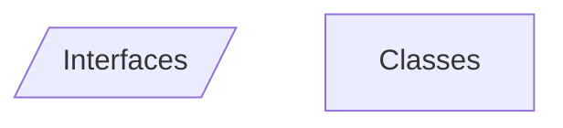
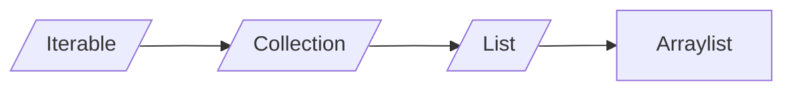
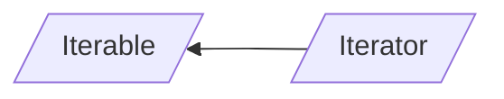
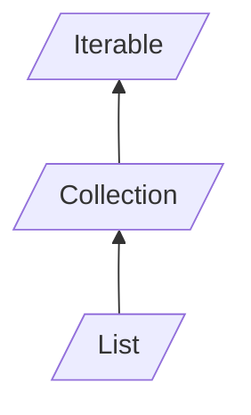

# Java
___
## Introduzione

I *paradigmi* di programmazione sono quello **operativo** e quello **funzionale**.
All'interno di tali *paradigmi* ci sono vari *stili di programmazione*.

Il *paradigma* è determinato dall'**assegnamento**.

```java
public class Main
{
	public static void main(String[] args)
	{
		int x = 3  //questa è un'inizializzazione
		x = 5 // questo è un assegnamento
	}
}
```

Per scrivere funzioni in *Java* non appartenenti a classi bisogna fare così:
 
```java
public class Main{
	public static int f(int n){
		return n + 1;
	}

	public int g(int n){
		return n+1;
	}
}
```

La funzione f è **statica** e non è un **metodo** poiché non necessita di istanze e utilizzo di altri oggetti.
Anche il **main** è un metodo **statico**, perché se così non fosse bisognerebbe istanziare qualcosa per poterlo avviare.
Nel **main** per invocare f basta fare `int x = f(7)` mentre per invocare g bisogna almeno istanziare l'oggetto cui appartiene `int y = new Main().g(7)`.
Un altro modo per invocare g è:

```java
Main o = new Main();
int y = 0.g(7);
```

La semantica è la stessa, tuttavia nel primo caso l'oggetto verrà distrutto dal **garbage collector** mentre nel secondo rimane attivo.
Un oggetto viene costruito **solo** con una `new`.

```java
Main o;
int x = o.g(y);
```

Il codice precedente **compila**, tuttavia a **runtime**  sarà lanciata un'eccezione.
La variabile `o` in questo caso non è un oggetto, è solo il "luogo in cui tenerlo", una **reference**.
*Java* è infatti un linguaggio in cui le chiamate avvengono **by reference**, solamente i *tipi primitivi* sono chiamati **by value**. Gli **oggetti** pertanto sono chiamati *reference types*.

```java
Main a = new Main();
Main b = a;
```

La variabile b è un *alias*, ovvero un altro pointer allo stesso oggetto. Le **classi** sono i *tipi*, gli **oggetti** sono i *valori* (o *istanze*).
Un linguaggio è *ad oggetti* quando offre il **subtyping** (ovvero una forma di **polimorfismo**).

## Polimorfismo

```java
public class Main{
	public class Animal
	{
	
		protected int weight;
		
		public Animal(int w)
		{
			this.weight = w;
		}
		public void eat(Animal a)
		{
			this.weight = a.weight;
		}
	}
	
	public class Dog extends Animal
	{
		private boolean pedgree;
		
		public(int w, boolean ped)
		{
			super(w);
			this.pedgree = ped;
		}
		
		public void bark()
		{
			System.out.println("bau!");
		}
		
		@Override
		public void eat(Animal a)
		{
			this.weight += a.weight * 3;
		}
	}
	
	public static void main(String[] args)
	{
		Dog fido = new Dog(30, false);
		Dog gigio = fido; //alias per fido
		Animal pluto = new Dog(40, true);
		Dog pippo = new Animal(50) // non si può fare
		pluto.bark() //non si può fare perché staticamente ha                      //tipo animal 
		pluto.eat(fido); //Dynamic dispatching, viene                                  //chiamata la eat di dog
		
		Collection<Integer> c = ArrayList<Integer>();
		int sz = c.size(); //Ancora dynamic dispatching
		
		gigio.eat(gigio); //legale per subsumption
		
		pluto = gigio; //pluto resta staticamente un Animal
	} 
}
```

L'*override* serve a modificare metodi preesistenti nelle sottoclassi e di conseguenza poterli usare, anche grazie al *dynamic dispatching*.

**Dynamic Dispatching** : dopo la chiamata del metodo viene utilizzato il tipo dinamico                                                              dell'oggetto, conosciuto a runtime.
**Subsumption** : possibilità di assegnare ad una cosa meno specifica, una più specifica.

## Classi e Interfacce

*Estendere*  (`extends`) ed *implementare* (`implements`) un'interfaccia sono concetti equivalenti.
Le *interfacce* non hanno costruttori.
Gli unici metodi implementabili all'interno delle interfacce sono quelli con la keyword `default`.
La *classe* che implementa l'*interfaccia* è **sottotipo** di quest'ultima e deve implementare **tutti** i metodi dell'*interfaccia*, tranne quelli di **default** .

``` java
public class Misc
{
	public inteface I
	{
		void a();
		void b();
		
		default void c()
		{
			a();
			b();
		}
	}
	
	public static abstract class J
	{
		public abstract void a();
		public abstract void b();
		
		public void c()
		{
			a();
			b();
		}
	}
	
	public static class C implemets I
	{
		@Override
		public void a(){}
		@Override
		public void b(){}
	}
	
	public static void main(String[] args)
	{
	
	}
}

```





```java
import java.util.ArrayList;
import java.util.Collection;

public class ProveJDK1
{
	public static void main(String[] args)
	{
		Iterable<Integer> l = new ArrayList<Integer>();
		l.add(21);
		l.add(2);
		l.add(456);
		l.set(2, 987) //set(int, <T>)
		
		Iterator<Integer> it = l.iterator();
		while(it.hasNext())
		{
			int n = it.next();
			System.out.println(n);
		}
		
		
		// Iterazione c-like
		for(int i = 0; i < l.size(); i++)
		{
			int n = l.get(i);
			System.out.println(n);
		}
	}
}
```

## Creazione di iteratori
In java ogni interfaccia deve avere un *file a parte* (o essere *nested*), pertanto ogni blocco di codice corrisponderà ad un diverso file.



## TinyJDK
```java
package tinyjdk;

public interface Iterator<T>{ // T = type parameter
	boolean hasNext();
	T next();
}
```

```java
package tinyjdk;

public interface Iterable<E>{ // E = type parameter
	Iterator<E> iterator();
}
```

```java
package tinyjdk;

public interface Collection<T> extends Iterable<T>{
	void add(T x);
	
	default void addAll(Collection<T> c){ 
	//T --> type argument
		Iterator<T> it = c.iterator();
		while(it.hasNext()){
			add(it.next());
		}
	}
	
	default void clear();
	
	default boolean contains(T x){
		Iterator<T> it = iterator();
		
		while (it.hasNext()) {
			T e = it.next();
			
			if (e.equals(x))
				return true;
		}
		
		return false;
	}
}
	
	boolean isEmpty();
	
	void remove(T x);
	
	int size();
}
```

```java
package tinyjdk;

public interface List<T> extends Collection<T>{
	T get (int i) throws IndexOutOfBoundsException;
	
	T set(int i, T x);
	
	void add(int i, T x);
	
	T remove(int i); // java non da errore senza binding
}
```

```java
package tinyjdk;

public class ArrayList<T> implements List<T>{
	private Object[] a;
	private int sz;
	
	public Arraylist(){
	//con new T[10] da errore --> limitazione del linguaggio
		this.a = new Object[10];
		this.sz = 0;
	}
	
	@Override
	public void add(T x){
		if(zs >= a.length{
			Object[] old = a;
			a = new Object[a.length() * 2]
			for(int i = 0; i < old.length; i++){
				a[i] = old[i];
			}
		}
		s[sz++] = x; // subsume x ad object
	}
	
	@Override
	public void clear(){
		sz = 0; 
	}
	/*
		non può essere static perchè non altimenti i metodi
		della classe enclosing non andrebbero. Se fosse static
		avrebbe comunque il suo this. Anche i generics non
		funzionerebbero.
	*/
	
	// static nested iterator --> non va nella virtal table
	private static class StaticMyIterator<T> implements
	Iterator<T>{
		private int pos = 0;
		private ArrayList<T> enclosing;
		
		public StaticMyIterator(ArrayList<T> a){
			this.enclosing = a;
		}
		
		@Override
		public boolean hasNext(){
			return this.pos < enclosing.size();
		}
		
		@Override
		public T next(){
			return enclosing.get(pos++);
		}
	}
	
	//non-static nested iterator
	private class MyIterator implements Iterator<T> {
		
		private int pos = 0;
		
		@Override
		public boolean hasNext(){
			return this.pos < Arraylist.this.size();
			// size appartiene alla classe enclosing
		}
		
		@Override
		public T next(){
			return get(pos++);
			//anche get è della classe enclosing
		}
	}
	
	@Override
	public Iterator<T> iterator(){
		//anonymous class
		return new Iterator<T>() {
			
			private int pos = 0;
			
			@Override
			public boolean hasNext(){
				return pos < size;
			}
			
			@Override
			public T next(){
				return get(pos++);
			}
		};
		/*
			Chi sta fuori ha staticamente un iterator, quindi
			non importa se la classe è private
		*/
	}
	
	@Override
	public int size(){
		return sz;
	}
	
	@Override
	public T get(int i) throws IndexOutOfBoundsException{
		if(i < sz)
			return (T) a[i]; //brutto ma legale e funzionante!
		
		//Eccezione unchecked
		throw new RuntimeException(String.format
		                          ("Arraylist.get():index %d
		                            out of bound %d" i, sz));
		
		//Eccezione checked
		throw new IndexOutOfBoundsException(String.format
		                                ("Arraylist.get():
		                                 index %d out of
		                                 bound %d" i, sz));
		/*
		Ho implementato entrambe le possibilità ma assumo di
		utilizzare l'eccezione checked come nella class
		originale
		*/ 
	}
	
	@Override
	public T set(int i, T x){
		if(i < sz){
			T old = get(i);
			a[i] = x; //brutto ma legale e funzionante!
			return old;
		}
		//Eccezione unchecked
		throw new RuntimeException(String.format
		                          ("Arraylist.get():index %d
		                            out of bound %d" i, sz));
	
	}
	
	@override
	public boolean isEmpty(){
		return sz == 0;
	}
	
	@Override
	public void add(int i, T x){
		//TODO
	}
	
	@Override
	public void add(T x){
		//TODO
	}
	
	@Override
	boolean equals(Object o){
		
		if(o instanceof ArrayList){
			(...)
		}
		
		return false
	}
	
	@Override
	public void remove(T x){
		
		for(int i = 0; i < size(); ++i){
			T o = get(i);
			
			if(o.equals(x)){
				
				for(int j = i; j <size() - 1; ++j ){
					set(j, get(j + 1));
				}
				
				--sz;
			}
		}
	}
}
```

```java
package tinyjdk;

public class LinkedList<T> implements List<T>{
	
	// non-static nested class
	protected class Node{ //meglio protected per sottoclassi
		
		public T data;
		public Node next;
		
		public Node(T data, Node next){ // argument forwarding
			
			this.data = data;
			this.next = next;
		}
	}
	
	protected Node head; //meglio protected per sottoclassi
	protected int sz;    //meglio protected per sottoclassi
	
	public LinkedList(){
		this.head = null;
		sz = 0;
	}
	
	@Override
	public void add(T x){
		if(head == null){
			head = new Node(x, null);
		} else {
			Node n = head;
			while(n.next != null){
				n = n.next;
			}
			n.next = new Node(x, null);
		}
		sz++;
	}
	
	@Override
	public void clear(){
		head = null;
		sz = 0;
		/*
			garbage collector multishot perché gli elementi
			in coda hanno ancora reference type.
			
			Sarebbe meglio mettere tutto a null.
		*/
	}
	
	@Override
	public void size(){
		return sz;
	}
	
	protected Node getNode(int i){ //meglio protected per 
								 //sottoclassi
	
		if (i < 0 || i >= size())
			throw new RuntimeException
			          (String.format("LinkedList.getNode(): 
			           index %d is out of bound size(): %d",
			           i, size()));
		
		Node n = head;
		
		for(; i > 0; --i)
			n = n.next;
	}
	
	@Override
	public T get(int i){
		/*
		if (i < 0 || i >= size())
			throw new RuntimeException
			          (String.format("LinkedList.get(): index 
			            %d is out of bound size(): %d",
			            i, size()));
		
		Node n = head;
		
		for(; i > 0; --i)
			n = n.next;
		
		return n.data;
		BRUTTO!
		*/
		return getNode(i).data;
	}
	
	@Override
	public T set(int i, T x){
	/*
	if (i < 0 || i >= size())
			throw new RuntimeException
			          (String.format("LinkedList.set(): index 
			            %d is out of bound size(): %d",
			            i, size()));
		
		Node n = head;
		
		for(; i > 0; --i)
			n = n.next;
		
		T old = n.data;
		n.data = x;
		return old;
		BRUTTO!
		*/
		
		// senza binding dovrei chiamare 2 volte getNode();
		//il binding serve per riusare un dato.
		Node n = getNode(i);
		T old = n.data;
		n.data = x;
		return old;
	}
	
	@Override
	public Iterator<T> iterator(){
	
		return new Iterator(){
		
			private Node n = head;
			
			@Override
			public boolean hasNext(){
				
				return n != null;
			}
			
			@Override
			public T next(){
				
				T r = n.data;
				n = n.next;
				return r;
			}
		}
	}
	
	@Override
	public void remove(T x){
		//scorriamo senza iteratore perché ci serve il nodo
		Node n = head;
		if(head != null){
			if(n.data.equals(x)){
				head = n.next;
				--sz;
			}
			else{
				while(n.next != null){
					if(n.next.data.equals(x)){
						n.next = n.next.next;
						--sz;
						return;
					}
					n = n.next;
				}
			}
		}
	}
}
```

```java
package tinyjdk

public static class IndexOutOfBoundsException extend Exception{
		public IndexOutOfBoundsException(string msg){
			super(msg);
		}
	}
```

```java
package tinyjdk
//Metodo globale -> non preferibile
public class ArrayListIterator<T> implements Iterator<T> {
        
        private int pos = 0;
        private ArrayList<T> enclosing;
        
        public ArrayListIterator(ArrayList<T> a) {
            this.enclosing = a;
        }
        @Override
        public boolean hasNext() {
            return this.pos < enclosing.size();
        }
        @Override
        public T next() {
            return enclosing.get(pos++);
        }

}
```
*Nota*: 
* In `Collection<T>`, `T`$\to$ **type parameter**
* In `Iterable<T>`, `T` $\to$ **type argument**

*Nota*: senza i **generics** si rischia di subsumere troppo con `Objects`.
## Type Parameter e Type Argument
```java
void f(int n){...} // --> n = type parameter
f(7); // --> 7 = type argument
```
**Type Parameter** determina il nome dei tipi, mentre **Type Argument** lo usa.
## Eccezioni Checked e Unchecked
* Le eccezioni **unchecked** non hanno bisogno della keyword `throws`ne del costrutto `try{...}catch{...}`,  tuttavia potrebbero non essere raccolte.
* Al contrario le eccezioni **checked** ne hanno bisogno e devono essere propagate gerarchicamente.
* Se l'anomalia *non è frequente* meglio scegliere un'**eccezione unchecked**.
* Se l'anomalia *è frequente* ed è ritenuta un *secondo possibile esito del codice* megio scegliere un **eccezione checked**.
## Virtual Table e Dynamic Dispatching
Alla creazione di un campo in Java  (prima della chiamata al costruttore), questo viene inizializzato a  `NULL`, se è un **reference type**, a 0 se è un **int**.
Di conseguenza quando viene chiamato il costruttore, c'è già della memoria allocata (8 Byte per i pointer, 4 per gli int), il compilatore sa quanto allocare sulla base della sommatoria dei campi della classe.
Viene inoltre creata una tabella, detta **Virtual Table**, che contiene pointer ai metodi della classe, i quali puntano alla prima istruzione dei corrispondenti metodi. Ciò avviene perché quando una classe istanziata viene passata a qualcos'altro si crea **subsumpion**, e di conseguenza alla chiamata di un metodo della classe si può recuperare quest'ultimo dalla virtual table della stessa. Grazie all'uso delle virtual table Java implementa il **Dynamic Dispatching**. Quando viene creato un oggetto, viene prima allocato lo spazio necessario per i campi ed in seguito la virtual table, che contiene anche i metodi sottoposti ad **Override**. Il dynamic dispatching non viene applicato ai metodi **statici**.
## TinyJDK: Anonymous Class

```java
(...)new Iterator<T>() {
		
		private int pos = 0;	
		
		@Override
		public boolean hasNext(){
			return pos < size;
		}
		
		@Override
		public T next(){
			return get(pos++);
		}
	}
```

Un codice è formato da:  
* **statement**: porzioni di codice formate da una o più righe e delimitati dalle graffe.  $\to$ (inizializzazioni, dichiarazioni, `return`, `if`, `do`, `for`, `throw` ...).
* **espressioni**: computano qualcosa, come fra le tonde dell'`if`  $\to$ (`(n < 8)`, `(n - 8)`...).

Il codice riportato è una **classe anonima**, ovvero un' **espressione**. La classe anonima permette di istanziare al momento un nuovo oggetto. La keyword `new` viene riutilizzata, in quanto quello che lancia non è un costruttore. Il nome anonymous class è sbagliato perché quello che abbiamo davanti è un **anonymous object**. Il nuovo oggetto viene subsunto ad `Iterator`, pertanto, nel caso in cui venga creato un nuovo metodo nella classe anonima, questo non può essere utilizzato. Dalla classe anonima si può accedere ai campi istanziati nello scope del metodo che la chiama (cioè *la classe porta con sé lo scope in cui è stata definita* $\to$ **chiusura**):

```java
public Iterator<T> iterator(){
	
	int pos = 0;
	
	return new Iterator<T>() {
		
		@Override
		public boolean hasNext(){
			return pos < size;
		}
		
		@Override
		public T next(){
			return get(pos++);
		}
	};
}
```

## Metodi == e equals
* `==`: se i due elementi sono **reference type** controlla i puntatori, se **value type** fa un vero confronto, è **polimorfo** e **omogeneo** (funziona con due oggetti dello stesso tipo),
* `equals`: è un metodo della classe `Object` reso standard, è **polimorfo per subtype** ed è **eterogeneo**. In genere si usa `equals` per fare una deep copy. $\to$ *è un semplice metodo*.

## TinyJDK: Set
I **Set** sono strutture dati:
* *Lineari*.
* *Senza random access*.
* *Senza duplicati* $\to$ grazie ad `equals`.

```java
package tinyjdk

public interface Set<T> extends Collection<T>{
	
}
```

```java
package tinyjdk;
public class StructuralSet<T>
        extends AbstractResizableArray<T>
        implements Set<T> {
    @Override
    public void add(T x) {
        if (!contains(x))
            super.add(x);
    }

    @Override
    public void remove(T x) {
        // TODO
    }

    @Override
    public Iterator<T> iterator() {
        // TODO
        return null;
    }
}
```

**Stub**: wrapper minimale.

Per evitare gli stub potremmo usare `extends Arraylist` tuttavia in questo caso avremmo il random access e nelle sottoclassi non si possono rimuovere metodi della superclasse, poiché si *perderebbe il polimorfismo*.  Possiamo quindi usare usa **superclasse astratta**.

```java
package tinyjdk;

public abstract class AbstractResizableArray<T> implements Collection<T> {
	//non si può fare la new di un array su generics
    protected Object[] a;
    protected int sz;

    public AbstractResizableArray() {
        this.a = new Object[10];
        this.sz = 0;
    }

    @Override
    public void add(T x) {
        if (sz >= a.length) {
            Object[] old = a;
            a = new Object[a.length * 2];
            for (int i = 0; i < old.length; ++i)
                a[i] = old[i];
        }
        a[sz++] = x;
    }

    @Override
    public void clear() {
        sz = 0;
    }

    @Override
    public boolean isEmpty() {
        return sz == 0;
    }

    public abstract void remove(T x);

    @Override
    public int size() {
        return sz;
    }

    public abstract Iterator<T> iterator();
}
```

```java
package tinyjdk;

public class ArrayList2<T> extends AbstractResizableArray<T> implements List<T> {
    @Override
    public void remove(T x) {
        for (int i = 0; i < size(); ++i) {
            T o = get(i);
            if (o.equals(x)) {
                for (int j = i ; j < size() - 1; ++j)
                    set(j, get(j + 1));
                --sz;
            }
        }
    }

    @Override
    public Iterator<T> iterator() {
        return new Iterator<T>() {
            private int pos = 0;
            @Override
            public boolean hasNext() {
                return pos < size();
            }

            @Override
            public T next() {
                return get(pos++);
            }
        };
    }

    @Override
    public T get(int i) {
        if (i < sz)
            return (T) a[i];
        throw new RuntimeException(String.format("ArrayList.get(): index %d out of bounds %d", i, sz));
    }

    @Override
    public T set(int i, T x) {
        if (i < sz) {
            T old = get(i);
            a[i] = x;
            return old;
        }
        throw new RuntimeException(String.format("ArrayList.set(): index %d out of bounds %d", i, sz));
    }

    @Override
    public void add(int i, T x) {
        // TODO
    }

    @Override
    public T remove(int i) {
        // TODO
        return null;
    }
}
```

```java
package tinyjdk;

public class HashSet<T> extends AbstractResizableArray<T> implements Set<T>{

    @Override
    public void add(T x) {
        if (!contains(x))
            super.add(x);
    }
    @Override
    public boolean contains(T x) {
        Iterator<T> it = iterator();
        int h = x.hashCode();
        while (it.hasNext()) {
            T e = it.next();
            if (e.hashCode() == h)
                return true;
        }
        return false;
    }
    @Override
    public void remove(T x) {
        // TODO
    }

    @Override
    public Iterator<T> iterator() {
        // TODO
        return null;
    }
}
```
## Confronti in informatica
* **Strutturale** $\to$ confronto deep (in java con `equals`). 
* **Shallow** $\to$ confronto shallow  (in java con `==`).
* **Hash** $\to$ confronta usando gli hash. 
## TinyJDK: Sorted Set
**Sorted set** è una categoria intera di set (non un'implementazione specifica), pertanto viene implementato con un'*interfaccia*.

Il problema è *ordinare cose che non sappiamo cosa sono* $\to$ si demanda a chi implementa l'interfaccia di implementarsi il metodo come preferisce. La stessa cosa avviene con `equals` della classe `Object`.

Sarebbe corretto mettere in `T` la logica del confronto. Bisogna **pretendere** che `T` estenda un oggetto comparabile.

```java
package tinyjdk;

public interface Comparable<T> {
	int compareTo(T x);
}
```

```java
package tinyjdk

public interface SortedSet<T extends Comparable<T>> extends Set<T> {
	
	//metodi per conoscere l'elemento più piccolo e più grande
	T first();
	T last();
	
	//boolean lessThan(T x, T y);
}
```

```java
package tinyjdk;
import java.util.Collections;

public class StructuralSortedSet<T extends Comparable<T>>
		extends StructuralSet<T>
		implements SortedSet<T> {
		
		@Override
		public T first(){
			if(isEmpty()) throw NoSuchElementException();
			
			return (T) a[0];
		}
		
		@Override
		public T last(){
			if(isEmpty()) throw NoSuchElementException();
			
			return (T) a[size - 1];
		}
		
		@Override
		void add(){
			super.add();
			sort();
		}
		
	//static <T extends Comparable<T>> void sort(List<T> l);
	//static <T> void sort(T[] a; Comparator <? super T> c);
		private void sort(){
			//Collections.sort()
			
			T[] a = (T[]) this.a; //shadowing
			
			Arrays.sort(a, size(), new Comparator<T>() {
			/*
				la compare di comparator non è statica 
				perché, se così fosse, non avrebbe 
				dynamic dispatching.
			*/
				@Override
				public int compare(T o1, To2){	
			//compare ritorna un int -> three way semantics
					return o1.compareTo(o2);
				}
			}):
		}
}
```

## Keyword extends
La keyword **extends** assume 3 significati:
* Su un'**interfaccia** per ereditare un'**interfaccia padre** (*In java un'interfaccia può avere più padri*).
* Su una **classe** per ereditare una **classe padre** (*In java una classe può avere un solo padre*).
* Su un **generic** per dire che ha le caratteristiche di un'**interfaccia**.
## Utility Class
*Contenitore di metodi*, **non istanziabile** (e pertanto non pensata per programmare ad oggetti). *Fornisce una serie di metodi statici*.
## Comparable e Comparator
* **Comparable** prende un parametro in input e lo confronta con this.
* **Comparator** prende due parametri in input e li confronta.
## Funzioni Binarie
Sono funzioni che operano su **due** oggetti (fra queste vengono inclusi anche gli *operatori*).
In java possono essere implementate in 2 modi:
* `this.method(Object o)` $\to$ metodo di `this`.
 * `method(Object o1, Object o2)` $\to$ metodo che opera su due argomenti `o1` e `o2`.
## TinyJDK: Map

```java
package tinyjdk;

public class Pair<A,B>{
	public final A first;
	public final B second;
	
	public Pair(A a, B b){
		first = a;
		second = b
	}
}
```

L'interfaccia della mappa estende **Iterable** e non **Collection**, poiché quest'ultima contiene metodi che "stonano" con il concetto di mappa.

```java
package tinyjdk

public interface Map<K, V> extends Iterable<Pair<K,V>>{

	void put(K k, V v);
	
	V get(K k) throws KeyNotFoundException;
	
	class KeyNotFoundException extends Exception {
		
//facciamo Object perché le eccezioni non supportano generics
		public KeyNotFoundException(Object k){
			super(String.format("Key %s not found in map",k));
		}
	}
}
```

```java
public class Pair<K,V> implements Map<K,V>{
	
	private List<Pair<K,V>> l = new ArrayList<>();
	@Override
	public void put(K k, V v){
		assert(k != null); //posso avere chiavi duplicate
		l.add(new Pair<k,v>);
	}
	
	@Override
	public V get(K k) throws KeyNotFoundException{
	
	/*
		non possiamo usare il for each perche vuole l'iterable
		della standard library.
	*/
		
		Iterator<Pair<K,V>> it = l.iterator();
		for(int i = l.size() -1; i >= 0; --i){
			Pair<K,V> p = l.get(i);
			if(p.first().equals(x))
				return p.second;
		}
		throw new KeyNotFoundException()
	}
}
```
## Programmazione Pseudo-funzionale
Java permette di "emulare" lo stile *funzionale*.
La **programmazione pseudo-funzionale** permette di scrivere codice *più robusto* (meno soggetto a bug).

```java
package func;

import java.util.Collection;

public class Lambda{
	
	//mi tocca averne due perché void non è un tipo
	
	interface MyFunction<T> {
		void apply(f x);
	}
	
	interface Function<A,B>{
		B apply (A x);
	}
	
	/*
	trasforma una collection in un'altra grazie ad una
	funzione di trasformazione
	*/
	public static <A,B> Collection<B> map(Iterable<A> c, 
										  Function<A,B> f){
		Collection<B> r = new ArrayList<>();
		for(A x : c){
			B b = f.apply(x);
			r.add(b);
		}
		return r;
	}
	
	public static <T> void forEach(Iterable<T> c,
								  MyFunction<T, void> f){
								  
		for(T x: c) {
			f.apply(x);
		}
	}
}

public static void main(String[] args){
	List<Integer> l = List.of(1,2,3,4);
	
	//chiamata con anonymous class
	forEach(l, new MyFunction<Integer>(){
		
		@Override
		public void apply(Integer x){
			System.out.println(x);
		}
	});
	
	//chiamata con lambda
	forEach(l, x -> System.out.println(x));
	
	//chiamata con anonymous class
	forEach(l, new MyFunction<Integer>(){
		
		@Override
		public void apply(Integer x){
			x = x + 1;
		}
	});
	
	//chiamata con lambda
	foEach(l, x -> x = x + 1);
	
	//chiamata con anonymous class
	forEach(l, new MyFunction<Integer>(){
		
		@Override
		public void apply(Integer x){
			if(x > 5)
				x = x + 1;
		}
	});
	
	//chiamata con lambda
	foEach(l, x -> {if (x > 5) x = x + 1});
}

public static void main2(String[] args){
	List<Integer> l = new Arraylist<>();
	
	//Chiamata con anonymous class
	Collection<Integer> r = map(l,
							new Function<Integer,Integer>(){
		@Override
		public Integer apply(Integer x){
			return x + 1;
		}
	});
	
	//Chiamata con lambda con return
	Collection<Boolean> r0 = map(l, x -> x > 0)
	
	//Chiamata con lambda con return
	Collection<Integer> r2 = map(l, x x -> x + 1);
	
	//Chiamata con lambda con return come statement
	//Il return è uno statement
	Collection<Integer> r3 = map(l , x -> {return x + 1});
}

```

Una **funzione di ordine superiore** è una funzione che ne prende altre come parametro.
`Function<input, output>` è un tipo definito dal JDK per tipizzare le funzioni.

Un'**entità del primo ordine** sono elementi che possono essere, costruiti, passati e manipolati.

In java per passare funzioni come parametri vengono usate le **lambda**, ovvero piccole porzioni di codice passate *on the fly*. Sono anche emulabili grazie alle *anonymous class*.
La sintassi è una delle seguenti:
* `parametro -> corpo`.
* `(tipo_parametro parametro) -> corpo`

In java, le seguenti funzioni sono dette "*4 forme di lambda*":
* **Function**: *prende* e *ritorna*.
* **Consumer**: *prende* e *non ritorna*.
* **Supplier**: *non prende* e *ritorna*.
* **Runnable**: *non prende* e non *ritorna*.

Computazione e Side-Effect:
* **Computazione** $\to$ avviene quando una funzione prende un *input* e ritorna un *output* (e.g. caricare di un file).
* **Side-Effect**: $\to$ avviene quando una funzione prende un *input* e modifica lo *stato* senza ritornare un *output*(e.g. salvare un file).
## Funzione Filter

```java
package func;

import java.util.Collection;

inteface Predicate<T> extends Function<T, Boolean> {}

//versione pura
public static<T> Collection<T> filter(Iterable<T> c,
									  Predicate<T> f){
	Collection<T> r = new Arraylist<>();
//Il for each viene 'dezuccherato' nel pattern dell'iteratore
	for(T x : c){
		if(f.apply(x)); //con test() usiamo Predicate del JDK
			r.add(x);
	}
	return r;
}

public static void main3(String[] args){
	List<Integer> l = List.of(1,2,3,4,5)
	Collection<Integer> c1 = filter(l, x -> x > 2);
}

//versione impura
public static void filter_impure(Iterable<T> c, Function<T,
								 Boolean> F){
	Iterator<T> it = c.iterator();
	while(it.hasNext()){
		if(!f.apply(it.next()))
			it.remove();
	}
	
	
	
	/*
	O(n^2)
	
	for(T x : c){
		if(!f.apply(x)){
			c.remove(x);
		}
	}
	*/
}
```

La funzione `filter` serve appunto a **filtrare** una collection, applicando ad ogni elemento una funzione, può essere:
* **Pura**: senza *side-effect*, ritorno una nuova collection.
* **Impura**: con *side-effect*, non ritorno nulla.

Tutti i metodi sono **static** perché non sfruttano lo stato della classe.
## Thread

I **thread** condividono *metodi* e *campi statici* (nel senso di conosciuti dal compilatore) con il **processo**.
Condividono, in maniera più precisa:
* **Code Segment**.
* **Data Segment**.

```java
package concurrent;

public class Threads{
	
	public static String suffix = "baudo";
	
	public static void loop(String msg){
		while(true)
			System.out.println(msg + " " + suffix);
	}
	public static class Mythread extends Threads{
		@Override
		public void run(){
			loop("ciao");
		}
	}
	public static void main(String[] args){
		Thread t = new MyThread();
		t.start(); // non chiamo run
		loop("pippo");
		
		//modo alternativo
		
		//con anonymous class
		Thread t2 = new Thread(new Runnable(){
			@Override
			public void run(){
			 loop("ciccio")	
			}
		});
		
		//con lambda
		Thread t3 = new thread(() -> loop("ciccio"));
	}
	
}
```

Si potrebbe anche chiamare direttamente `run` al posto di `start`. Utilizzando `start` però si chiede al kernel di creare un vero thread, che verrà gestito dallo stesso. La **syscall** chiamata da `start` non è bloccante. La classe **thread** è un **runnable**. Ha a sua volta un costruttore che prende in input un **runnable**.
## Consumer - Producer
```java
package concurrent

public class ConsumerProducer{

	//statico perché l'enclosing non ha costruttore
	//se fosse non statico non verrebbe costruito
	public static List<Integer> buff = new ArrayList<>();
	
	public static class Producer extends Thread{
		
		public Producer(){
			super("Producer");
		}
		@Override
		public void run(){
			Random rnd = new Random();
			while(true){
					int n = rnd.nextInt();
					synchronized (buff){ //lock
						buff.add(n);
				//dico al consumer che è arrivato un dato
						buff.notify();
						System.out.printf("%s: added %d\n", 
										   getName(), n)
					} //unlock
				}
			}
		}
	}
	
	public static class Consumer extends Thread{
		
		public Consumer(){
			super("Consumer");
		}
		@Override
		public void run(){
			while(true){
				synchronized(buff){ //lock
					if(!buff.isEmpty()){
					//aspetto l'arrivo di un dato dal producer
						try{
							buff.wait();
						} catch (InterruptedException e){
							throw new RuntimeException(e);
						}
					}
					buff.remove(0);
					System.out.printf("%s: removed %d\n", 
										   getName(), n)
				} //unlock
			}
		}
	}
	
	public static void main(String[] args){
		Thread p = new Producer();
		Thread c = new Consumer();
		p.start();
		c.start();
		
		//toglie dalla coda e sveglia quando l'altro finisce
		p.join();
	}
	public static void main2(String[] args){
		Thread p = new Producer();
		Thread c = new Consumer();
		p.start();
		c.start();
		
		try{
			p.join();
			c.join();
		} catch ( InterruptedException e){}
	}
}
```

Fare la join di **thread** che hanno già finito non cambia l'esecuzione.
Un **monitor** è simile ad un semaforo e serve per mettere in attesa dei processi, che poi saranno svegliati da altri monitor. Per esempio ogni volta che il consumer è pronto lo notifica al producer con un *ping*.
Tutti i *reference type* di java sono monitor e anche semafori. In questo utilizziamo il monitor di `buff`.
Visto che più thread possono aspettare sullo stesso oggetto, la `notifyAll` sveglia tutti i thread in attesa. Se si aspetta qualcuno che non sveglia mai si entra in un **deadlock**. Per gestire i deadlock, il jdk offre un *eccezione* da gestire come preferiamo. Senza proteggere la sezione critica della `add` con un **mutex**, avremo un eccezione. Stampa e notifica nel producer possono stare fuori dalla sezione critica, possono tuttavia avere problemi con lo scheduler. È **necessario** usare come *monitor nella critical section*, lo stesso oggetto che funge da mutex per la stessa sezione critica. In ogni caso non è problematico usare come semaforo un oggetto differente da quello che vogliamo arbitrare. Poiché il quanto di tempo è molto grande rispetto alla print, sarebbe possibile portare la print fuori dalla sezione critica (e dichiarare n fuori dallo scope), tuttavia c'è una piccolissima probabilità che l'output venga corrotto dalla sovrapposizione di due print. 

```java
void f(){
	synchronized (mutex){
		f();
	}
}
```

Questa codice funziona perché se un thread ha già il lock può rimettere il rosso aumentando un **counter interno trasparente**. Bisogna solamente fare tante *unlock* quante sono le *lock*.
## Overloading

Permette di definire metodi nelle sotto-classi con stesso nome, ma tipi di ritorno e firma diversi rispetto a quelli delle super-classi
```java
public class Animal
	{
	
		protected int weight;
		
		public Animal(int w)
		{
			this.weight = w;
		}
		public void eat(Animal a)
		{
			this.weight = a.weight;
		}
		
		//Qui sto eseguendo un overload
		public void eat(int i){
			this.weight += i;
		}
	}
	
	public class Dog extends Animal
	{
		private boolean pedgree;
		
		public(int w, boolean ped)
		{
			super(w);
			this.pedgree = ped;
		}
		
		public void bark()
		{
			System.out.println("bau!");
		}
		
		@Override
		public void eat(Animal a)
		{
			this.weight += a.weight * 3;
		}
		
		//Anche qui sto facendo overload 
		public void eat(Dog d) {...}
	}
```

Qui ho tre versioni di `eat`:
* `eat(Animal a)`
* `eat(Dog d)`
* `eat(int i)`

Se un `dog` chiama il metodo su un altro `dog`, viene utilizzato il metodo più vicino, quindi `eat(Dog d)`

L'**override** può solo *ridefinire*, mai *definire*, può cioè cambiare solo il blocco di codice dentro le graffe.

Facciamo ora un sorgente unico più chiaro

```java
package wildcards

public class Overloading{
	public static class A{
		public void m(A a){}
	}
	public static class B extends A{
		//faccio un overload, anche se B è subtype di A
		public void m(B b){}
		//anche il seguente è un overload
		public int m(B b){return 1;}
		public double m(B b){return 0.;}
	}
	public static class C extends B{
		@Override
		public double m(B b){return 0.;}
	}
	
	int main(String[] args){
		B b new B();
	//se non faccio binding il compiler non sa chi chiamare
		b.m(b);
	//neanche in questo caso il compiler sa chi chiamare
		double n = b.m(b);
	}
}
```

 Nel caso di C sto facendo un **override**, poiché *il tipo di ritorno non fa parte della firma*, pertanto la firma è rimasta la stessa. L'esempio del main serve per sottolineare il fatto che java utilizza un sistema di **overloading context independent**, ovvero non riesce a capire quale overload chiamare solamente sulla base del contesto di esecuzione. L'overload di java controlla solamente i tipi e il numero dei parametri.

Facciamo una variante dello stesso codice:

```java
package wildcards

public class Overloading{
	public static class A{
		public A m(A a){return new A();}
		
		public Number n(){return 1.3;}
	}
	public static class B extends A{
		@Override
		public B m(B b){return new B();}
		
		@Override
		public Integer n() {return 2;}
	}
	
	int main(String[] args){
		A a = new A();
		Number u = a.n();
		
		A a2 = new B();
		//Dynamic Dispatching, chiamo quello di B
		Number u2 = a2.n();
}
```

In questo caso in `B` sto facendo un'**override** della funzione `m` in `A`, poiché la firma è uguale, mentre il tipo di ritorno è **covariante**. Il tipo di ritorno infatti *varia assieme a `this`*.

Se io tuttavia scrivessi `Integer u2 = a2.n()`, il compilatore non capirebbe che io ritornerò un *Integer* e quindi darebbe errore. La **covarianza** funziona a patto di avere tipi di ritorno "più stretti" rispetto all'originale quando si fa override. La **controvarianza** (che utilizza tipi di ritorno "più larghi" rispetto all'originale) è illegale, poiché i tipi di ritorno non combacerebbero a runtime. 

Segue esempio di controvarianza:

```java
package wildcards

public class Overloading{
	public static class A{
		public A m(A a){return new A();}
		
		public Integer n(){return 1;}
	}
	public static class B extends A{
		@Override
		public B m(B b){return new B();}
		
		@Override
		public Number n() {return 2.45;}
	}
	
	int main(String[] args){
		A a = new A();
		Number u = a.n();
		
		A a2 = new B();
		//Dynamic Dispatching, chiamo quello di B
		//Il compilatore dà errore per la controvarianza
		//Si spacca tutto a runtime, perché torno un Double
		Integer u2 = a2.n();
}
```

La regola quando si fa **override** dovrebbe essere: *si specializza il tipo di ritorno e si de-specializzano i parametri*.

Java però non permette di de-specializzare i parametri. 
Il motivo per cui java non permette la **controvarianza dell'input** va ricercato nella *type-erasure*, ovvero l'eliminazione dei **generics** a compile time e la loro sostituzione con l'**upper bound**(l'oggetto più vicina che estendono). Il problema sta nel fatto che il compilatore non può risolvere correttamente la controvarianza dell'upper bound dei generics eliminati e sostituiti.

Continuiamo col nostro esempio:
```java
package wildcards

public class Overloading{
	public static class A{
	
		public void p(List<Integer> l){}
		
		public void p(List<String> l){}
	}
	public static class B extends A{

	}
	
	int main(String[] args){
}
```

In questo caso le due funzioni `p` non funzionano, poiché dopo l'**erasure** le due firme sarebbero uguali (`public void p(List l)`) $\to$ **overload ambiguo**.
## Wildcards
```java
public class Misc{
	public static <A,B> List<B> map(Iterable<A> c, 
					Function<? super A,? extends B> f){
		List<B> r = new ArrayList<>();
		for(A x : c) {
			B b = f.apply(x);
			r.add(b);
		}
		return r;
	}
	public static void main(String[] args){
		List<String> l1 = List.of{"pippo","franco","ciccio"}
		List<Number> l2 = 
					map(l1, (CharSequence s) -> s.length()); 
	}
}
```

I **wildcards** ci permettono di applicare la contro-varianza anche agli input.

*Subsume solo il "guscio esterno", mai i generics (Type Argument)*.

```java
package misc;

public class Sorting{
	public static <T> void sort(List<T> list,
								Comparator<?super T> c) {...}
	
	public static class Animal{
		public int weight;
		
		public Animal(int w){ this.weight = w;}
	}
	
	public static class Dog extends Animal{
		public boolean pedigree;
		public Dog(int w, Boolean p){
			super(w);
			this.pedigree = p;
		}
	}
	
	public static void main(String[] args){
		List<Animal> l = new ArrayList<>();
		l.add(new Animal(50));
		l.add(new Animal(30));
		l.add(new Animal(20));
		
		sort(l, new Comparator<Animal>(){
			@Override
			public int compare(Animal o1, Animal o2){
				return o1.weight - o2.weight; 
			}
		});
	}
}
```

I **type argument** non subsumono automaticamente, per questo abbiamo anche `<? extends T>`. Java infatti non riesce a capire che che una classe è sottotipo di un'altra quando viene utilizzata dentro i **generics**.
# C++
___

È un linguaggio **strong-typed** con un type-checking molto "forte", tuttavia il suo sistema di template è problematico.

È un linguaggio **multi-paradigma**, poiché supporta *diversi stili* e anche *diversi paradigmi* di programmazione.
I paradigmi/stili forniti da C++ sono:
* Ad oggetti
* Imperativo-funzionale
* Generic Programming

```cpp
#include <iostream>

class animal{
//private: -> metto protected per OOP
protected:
	int weight;
	double speed;
public:
	
	//lista di inizializzazione
	//chiama i costruttori dei campi
	//in particolare i copy constructor
	
	animal(int w, double sp) : weight(w), speed(sp) {}
	
	//questo è un copy constructor
	animal() : weight(0), speed(0.0) {}
	
	//posso fare il default constructor così:
	animal() : weight(), speed() {}
	//o così
	animal() {}
	
	animal(const animal& a) : weight(a.weight), 
							  speed(a.speed) {}
	
	//lo lascio, ma in cpp non si fanno i getter
	int get_weight() const{
		return this -> weight;
	}
	
	//devo lasciare il const iniziale, altrimenti non
	//garantisco il const su this
	//equivale ad un getter -> solo right value
	const int& weight() const {return weight;}
	//questo è un overload, perché non c'è il const su this
	//anche in cpp l'overload è context-independent
	//come un setter -> anche left value
	int& weight() {return weight;}
	
	virtual void eat(const animal& a){
		weight += a.weight;
	}
};
```

* `animal(int w) : weight(w) {}` $\to$ costruttore per inizializzare i campi
* `animal(const animal& a) : weight(a.weight)` $\to$ costruttore per **copia**
  * `a` viene passato *const* per non essere modificato.
  * `a` viene passato per *reference* per non generare ricorsioni. 

A differenza di Java, in C++ `this` è un **pointer**, il suo tipo pertanto è `*class` (nel nostro caso è `* animal`).

In C++ bisogna specificare che su di un metodo si può eseguire l' **override** grazie alla keyword `virtual`. Questa keyword si chiama così perché specifica che quel particolare metodo va inserito in *virtual table*.
* **Dynamic-Dispatching** per i metodi che stanno in virtual table.
* **Static-Dispatching** per i metodi che non stanno in virtual table.

In C++ si può ereditare con diverse keyword sulla base della **subsumption**:
* `public` $\to$ così chiunque può usare la classe polimorficamente.
* `private` $\to$ così nessuno può usarla polimorficamente.
* `protected` $\to$ così solo i figli possono usarla polimorficamente.

La vera differenza fra C++ e Java è che nel primo **i campi vengono costruiti e non assegnati**.
In C++ non si dichiara mai, ma si **costruisce sempre**, anche con i tipi primitivi.
Gli *stack frame* di C++ sono *dinamici*.

```c++
int main(){
	//utilizzo la new. La variabile viene salvata nell'heap
	// In C++ la new ritorna un pointer
	animal* al = new animal(7, 2.34);
	
	//chiama il costruttore di default di int
	//x viene costruito nello stack
	int x;
	
	//fa la stessa cosa di int x, ma con un tipo
	//definito da noi
	// ha tipo animal
	animal a2(7, 2.34);
	
	//compiler context-free, chiama il costruttore per copia
	//a2 è di tipo animal, non animal*
	animal a3(a2)
	
	//questo a cpp va bene perché passo this anche
	//se vuole un campo const
	a2.eat(a2)
	
	dog fido(60, 45.34, false);
	//in cpp questa è una costruzione:
	//legacy -> deriva da versioni vecchie
	//usa un copy constructor
	animal a5 = fido;
	//è equivalente a questo:
	animal a5(fido);
	
	//non dispatcha eat di dog ma di animal
	//perché costruisco un animal
	a5.eat(a2)
	
	//in cpp il binding è solo per i reference
	animal& a5 = fido; 
	
	//Fa dynamic dispatching
	a5.eat(a2)
	dog* fufi = new dog(3,100., true);
	animal* a6 = fufi
	//Fa dynamic dispatching
	a6->eat(a2)
}
```

```cpp
τ* x = new τ(args) //costruisce sull'heap
τ x(args)          //costruisce sullo stack
```

Non scrivere l'**initializer list** equivale a scriverla così:
```cpp
animal(int w, double sp) : weight(), speed(){
	weight = w;
	speed = sp;
}
```

In java non ha senso modificare l'operatore di assegnamento perché lavoriamo solamente con pointer sull'heap, in C++ invece utilizziamo anche lo stack.

```cpp
class Dog : public animal{
private:
	bool has_pedigree;
public:
	//il padre è un campo del figlio
	dog(int w, double sp, bool ped) : animal(w,sp), 
									  has_pedigree(ped) {}
	
	void eat(const animal&) override {
		//stiamo chiamando due weight diversi.
		//perché this non è const mentre a sì.
		this.weight() += a.weight() / 2;
	}
}
```

Solo `this` può vedere i suoi  campi protected ereditati dal padre, i suoi "fratelli" no.
Se la `get_weight()` non assicura che `this` sia `const` avremmo un errore nell'implementazione della `eat` (che vuole in input un `const animal`).

In C++, quando si fa **override**, si può:
* **covariare** e **controvariare** l'*output*.
* solo **controvariare** l'*input*.

Se voglio continuare la "serie" di override, devo sempre mettere `virtual`.
**Quando una cosa è costante, resta costante**.

In C++:
* I reference **subsumono**.
* I valori **non subsumono**.

 L'operatore `[]` di `vector` fa l'**inlining**, ovvero sostituisce il blocco di codice della funzione alla relativa chiamata, evitando una `jump` al compilatore.

Facciamo una matrice **flattened** per motivi di efficienza.

Utilizzando `vector` al posto degli array nativi guadagniamo in gestione della memoria, che viene automatizzata.
C++ usa uno **stile di programmazione** detto *value-oriented programming*, il quale deve specificare sempre:
* default constructor
* copy constructor
* operatore di assegnamento

Questo stile rende il tipo creato molto simile ai valori nativi del linguaggio.
In C++ i **costruttori unari** (con un solo parametro) sono *operatori di conversione*. 

Per esempio, se noi avessimo una funzione che prende in input una `matrix` e le passassimo un `int`, questa compilerebbe e chiamerebbe il costruttore `matrix(size_t dim)` della classe `matrix`.  Se si mette davanti al costruttore la keyword `explicit` si impedisce di chiamare implicitamente il costruttore e di conseguenza si impedisce la conversione.

Nel nostro esempio il distruttore non serve, poiché viene automaticamente chiamato quello di `vector`.

*Nota*: 
* L'operatore `[]` si chiama **subscript**.
* L'operatore `()` si chiama **application operator**.

```cpp
#include <iostream>
#include <vector>

using namespace std;

template <class T>
class matrix
{
private:
	size_t cols;
	vector<T> v;
public:
	matrix() : v() {}
	
	matrix(const matrix<T>& m) : v(m.v) {}
	
	//nella seconda parte del costruttore usa il campo cols
	//per farlo però cols deve essere inizializzato
	//visto che le initializer list devono essere in ordine
	//cols è stato messo prima di v all'inizio della classe
	matrix(size_t rows, size_t _cols) : cols(_cols)
									   v(rows * cols) {}
	
	//sostanzialmente mi permette di passare da un size_t
	//ad una matrix -> funzione di conversione
	matrix(size_t dim) : matrix(dim, dim) {}
	
	const T& operator()(size_t i, size_t j)
	{
		return v[i * cols + j]
	}
	
	T& operator()(size_t i, size_t j)
	{
		return v[i * cols + j]
	}
	
	//Assegnamento != Binding
	//L'assegnamento serve per la modifica
	//sta sottintendendo il parametro thie
	//nel nostro caso this è il left value
	//const matrix<T>&m è il right value
	//left e right value sono templatizzati sullo stesso tipo 
	matrix<T>& operator =(const matrix<T>& m){
		cols = m.cols //assegnamento fra size_t
		v = m.v //assegnamento fra vector
		
		//this deferenziato, perché sarebbe un pointer
		return *this:
	}
}

void main()
{
	matrix<int> m(20,30);
	
	// vengono chiamati 3 operatori
	m(8, 10) = m(3,4);
	
	matrix<int> m2(40,50);
	
	// le due righe sotto sono identiche
	// in cpp gli operatori sono metodi di classe
	m = m2;
	m.operator=(m2);
}
```

Meglio che l'*operatore di assegnamento* no sia `void`,  altrimenti non potremmo innestarlo in catene di assegnamenti.

Utilizzando i template, il compilatore rimanda la compilazione del codice templatizzato fino alla prima esecuzione.

Si scrive `class T` perché C++ permette di parametrizzare non solo **tipi** ma anche **valori**.
Si possono templatizzare:
* Classi
* Metodi
* Funzioni globali
* Typedef
* ...

Fra le cose che non si possono templatizzare troviamo:
* Namespaces
* Campi delle classi

```cpp
#include <iostream>
#include <vector>

using namespace std;

template <class T>
class matrix
{
private:
	size_t cols;
	vector<T> v;
public:
	matrix() : v() {}
	
	matrix(const matrix<T>& m) : cols(m.cols), v(m.v) {}
	
	// conversion constructor
	//converte la matrice di S in matrice di T
	//poi chiama il copy constructor
	//il compilatore non lo riconosce 
	template <class S>
	matrix(const matrix<S>& m) : cols(m.cols),
							v(m.get_cols() * m.get_rows) {
		
		for(int i = 0; i < v.size(); ++i){
			//supponiamo di avere un operatore di conversione 
			//fra s e T 
			//non così -> v[i] = m.v[i];
			
			//ma così
			//viene sostanzialmente chiamato il costruttore 
			//di T dato S
			//i cast sono un'altra cosa -> interpretare il 
			//data type in modo diverso
			//Viene usato solo fra puntatori.
			
			//Così stiamo assumendo che T abbia un 
			//costruttore che prende un S
			v[i] = T(m.v[i]);
		}
	}
	
	//nella seconda parte del costruttore usa il campo cols
	//per farlo però cols deve essere inizializzato
	//visto che le initializer list devono essere in ordine
	//cols è stato messo prima di v all'inizio della classe
	matrix(size_t rows, size_t _cols) : cols(_cols)
									   v(rows * cols) {}
	
	//sostanzialmente mi permette di passare da un size_t
	//ad una matrix -> funzione di conversione
	explicit matrix(size_t dim) : matrix(dim, dim) {}
	
	//operatore di conversione fra matrix<T> e vector<T>
	operator const vector<T>&() const
	{
		return v;
	}
	
	const T& operator()(size_t i, size_t j)
	{
		return v[i * cols + j]
	}
	
	T& operator()(size_t i, size_t j)
	{
		return v[i * cols + j]
	}
	
	//Assegnamento != Binding
	//L'assegnamento serve per la modifica
	//sta sottintendendo il parametro thie
	//nel nostro caso this è il left value
	//const matrix<T>&m è il right value
	//left e right value sono templatizzati sullo stesso tipo 
	matrix<T>& operator =(const matrix<T>& m){
		cols = m.cols //assegnamento fra size_t
		v = m.v //assegnamento fra vector
		
		//this deferenziato, perché sarebbe un pointer
		return *this:
	}
	
}
//non può stare dentro la matrice, perché this starebbe a 
//sinistra di os ma l'operator << non vuole, poiché a sinistra
// ci vuole l'ostream. È cout << matrix, non matrix << cout
template <class T>
ostream& operator<<(ostream& os, const matrix<T>& m)
{
	for(typename vector<T>::iterator it = m.v.begin();
		it != v.end; ++it ){
		
		(os << *it) << " ";
		
		//oppure
		
		typename vector<T>::value_type x = *it;
		
		//value_type è T
		
		os << x << " "
	}
	return os;
}

template <class Container>
ostream& operator<<(ostream& os, const Container& m)
{
	for(typename Container::iterator it = m.v.begin();
		it != v.end; ++it ){
		
		(os << *it) << " ";
		
		//oppure
		
		//value_type prende il tipo di *it
		
		typename Container::value_type x = *it;
		
		//value_type è T nel nostro caso
		
		os << x << " "
	}
	return os;
}

void main(){
	matrix<int> m(10, 20);
	
	//il template system viene costretto a generare il 
	//conversion constructor.
	matrix<double> m1(m);
	
}
```

In java la sintassi del cast è differente:
* Se sono **built-in** *converte*.
* Se sono **oggetti** avviene un *downcast* $\to$ si passa da tipi più generali ad altri più specifici.

I veri cast in C++ possono essere fatti **solo** con i *puntatori*:

```cpp
int n = 5;
double x = *((double* ) &n);
```

Cast vuol dire di per sé **forzare**.

Quando usiamo un template in C++, ci aspettiamo che quel particolare tipo `T` rispetti i vincoli necessari per eseguire il codice. All'inizio C++ controlla solo che la sintassi sia corretta, poi, nel momento in cui il codice viene usato, i tipi vengono  effettivamente controllati. 
Il **template system** di C++ è *generativo* $\to$ sostituisce ai template il tipo richiesto e poi ricompila.

In pratica ogni volta che viene usato un nuovo tipo al posto del template, C++ deve ricompilare il codice per vedere se funziona e generare un nuovo metodo con quei tipi.

`typename` è una keyword necessaria per specificare che ciò che segue è un tipo.
