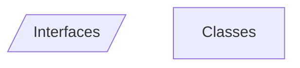
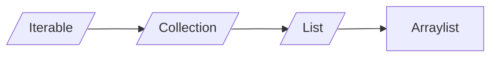
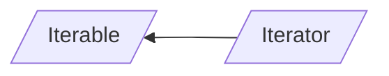
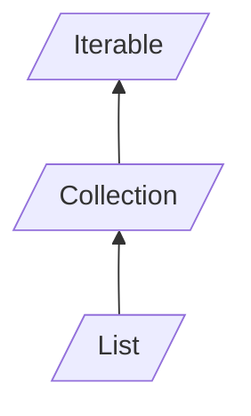

# Introduzione

I *paradigmi* di programmazione sono quello **operativo** e quello **funzionale**.
All'interno di tali *paradigmi* ci sono vari *stili di programmazione*.

Il *paradigma* è determinato dall'**assegnamento**.

```java
public class Main
{
	public static void main(String[] args)
	{
		int x = 3  //questa è un'inizializzazione
		x = 5 // questo è un assegnamento
	}
}
```

Per scrivere funzioni in *Java* non appartenenti a classi bisogna fare così:
 
```java
public class Main{
	public static int f(int n){
		return n + 1;
	}

	public int g(int n){
		return n+1;
	}
}
```

La funzione f è **statica** e non è un **metodo** poiché non necessita di istanze e utilizzo di altri oggetti.
Anche il **main** è un metodo **statico**, perché se così non fosse bisognerebbe istanziare qualcosa per poterlo avviare.
Nel **main** per invocare f basta fare `int x = f(7)` mentre per invocare g bisogna almeno istanziare l'oggetto cui appartiene `int y = new Main().g(7)`.
Un altro modo per invocare g è:

```java
Main o = new Main();
int y = 0.g(7);
```

La semantica è la stessa, tuttavia nel primo caso l'oggetto verrà distrutto dal **garbage collector** mentre nel secondo rimane attivo.
Un oggetto viene costruito **solo** con una `new`.

```java
Main o;
int x = o.g(y);
```

Il codice precedente **compila**, tuttavia a **runtime**  sarà lanciata un'eccezione.
La variabile `o` in questo caso non è un oggetto, è solo il "luogo in cui tenerlo", una **reference**.
*Java* è infatti un linguaggio in cui le chiamate avvengono **by reference**, solamente i *tipi primitivi* sono chiamati **by value**. Gli **oggetti** pertanto sono chiamati *reference types*.

```java
Main a = new Main();
Main b = a;
```

La variabile b è un *alias*, ovvero un altro pointer allo stesso oggetto. Le **classi** sono i *tipi*, gli **oggetti** sono i *valori* (o *istanze*).
Un linguaggio è *ad oggetti* quando offre il **subtyping** (ovvero una forma di **polimorfismo**).

# Polimorfismo

```java
public class Main{
	public class Animal
	{
	
		protected int weight;
		
		public Animal(int w)
		{
			this.weight = w;
		}
		public void eat(Animal a)
		{
			this.weight = a.weight;
		}
	}
	
	public class Dog extends Animal
	{
		private boolean pedgree;
		
		public(int w, boolean ped)
		{
			super(w);
			this.pedgree = ped;
		}
		
		public void bark()
		{
			System.out.println("bau!");
		}
		
		@Override
		public void eat(Animal a)
		{
			this.weight += a.weight * 3;
		}
	}
	
	public static void main(String[] args)
	{
		Dog fido = new Dog(30, false);
		Dog gigio = fido; //alias per fido
		Animal pluto = new Dog(40, true);
		Dog pippo = new Animal(50) // non si può fare
		pluto.bark() //non si può fare perché staticamente ha                      //tipo animal 
		pluto.eat(fido); //Dynamic dispatching, viene                                  //chiamata la eat di dog
		
		Collection<Integer> c = ArrayList<Integer>();
		int sz = c.size(); //Ancora dynamic dispatching
		
		gigio.eat(gigio); //legale per subsumption
		
		pluto = gigio; //pluto resta staticamente un Animal
	} 
}
```

L'*override* serve a modificare metodi preesistenti nelle sottoclassi e di conseguenza poterli usare, anche grazie al *dynamic dispatching*.

**Dynamic Dispatching** : dopo la chiamata del metodo viene utilizzato il tipo dinamico                                                              dell'oggetto, conosciuto a runtime.
**Subsumption** : possibilità di assegnare ad una cosa meno specifica, una più specifica.

# Classi e Interfacce

*Estendere*  (`extends`) ed *implementare* (`implements`) un'interfaccia sono concetti equivalenti.
Le *interfacce* non hanno costruttori.
Gli unici metodi implementabili all'interno delle interfacce sono quelli con la keyword `default`.
La *classe* che implementa l'*interfaccia* è **sottotipo** di quest'ultima e deve implementare **tutti** i metodi dell'*interfaccia*, tranne quelli di **default** .

``` java
public class Misc
{
	public inteface I
	{
		void a();
		void b();
		
		default void c()
		{
			a();
			b();
		}
	}
	
	public static abstract class J
	{
		public abstract void a();
		public abstract void b();
		
		public void c()
		{
			a();
			b();
		}
	}
	
	public static class C implemets I
	{
		@Override
		public void a(){}
		@Override
		public void b(){}
	}
	
	public static void main(String[] args)
	{
	
	}
}

```





```java
import java.util.ArrayList;
import java.util.Collection;

public class ProveJDK1
{
	public static void main(String[] args)
	{
		Iterable<Integer> l = new ArrayList<Integer>();
		l.add(21);
		l.add(2);
		l.add(456);
		l.set(2, 987) //set(int, <T>)
		
		Iterator<Integer> it = l.iterator();
		while(it.hasNext())
		{
			int n = it.next();
			System.out.println(n);
		}
		
		
		// Iterazione c-like
		for(int i = 0; i < l.size(); i++)
		{
			int n = l.get(i);
			System.out.println(n);
		}
	}
}
```

# Creazione di iteratori
In java ogni interfaccia deve avere un *file a parte* (o essere *nested*), pertanto ogni blocco di codice corrisponderà ad un diverso file.



# TinyJDK
```java
package tinyjdk;

public interface Iterator<T>{ // T = type parameter
	boolean hasNext();
	T next();
}
```

```java
package tinyjdk;

public interface Iterable<E>{ // E = type parameter
	Iterator<E> iterator();
}
```

```java
package tinyjdk;

public interface Collection<T> extends Iterable<T>{
	void add(T x);
	
	default void addAll(Collection<T> c){ 
	//T --> type argument
		Iterator<T> it = c.iterator();
		while(it.hasNext()){
			add(it.next());
		}
	}
	
	default void clear();
	
	default boolean contains(T x){
		Iterator<T> it = iterator();
		
		while (it.hasNext()) {
			T e = it.next();
			
			if (e.equals(x))
				return true;
		}
		
		return false;
	}
}
	
	boolean isEmpty();
	
	void remove(T x);
	
	int size();
}
```

```java
package tinyjdk;

public interface List<T> extends Collection<T>{
	T get (int i) throws IndexOutOfBoundsException;
	
	T set(int i, T x);
	
	void add(int i, T x);
	
	T remove(int i); // java non da errore senza binding
}
```

```java
package tinyjdk;

public class ArrayList<T> implements List<T>{
	private Object[] a;
	private int sz;
	
	public Arraylist(){
	//con new T[10] da errore --> limitazione del linguaggio
		this.a = new Object[10];
		this.sz = 0;
	}
	
	@Override
	public void add(T x){
		if(zs >= a.length{
			Object[] old = a;
			a = new Object[a.length() * 2]
			for(int i = 0; i < old.length; i++){
				a[i] = old[i];
			}
		}
		s[sz++] = x; // subsume x ad object
	}
	
	@Override
	public void clear(){
		sz = 0; 
	}
	/*
		non può essere static perchè non altimenti i metodi
		della classe enclosing non andrebbero. Se fosse static
		avrebbe comunque il suo this. Anche i generics non
		funzionerebbero.
	*/
	
	// static nested iterator --> non va nella virtal table
	private static class StaticMyIterator<T> implements
	Iterator<T>{
		private int pos = 0;
		private ArrayList<T> enclosing;
		
		public StaticMyIterator(ArrayList<T> a){
			this.enclosing = a;
		}
		
		@Override
		public boolean hasNext(){
			return this.pos < enclosing.size();
		}
		
		@Override
		public T next(){
			return enclosing.get(pos++);
		}
	}
	
	//non-static nested iterator
	private class MyIterator implements Iterator<T> {
		
		private int pos = 0;
		
		@Override
		public boolean hasNext(){
			return this.pos < Arraylist.this.size();
			// size appartiene alla classe enclosing
		}
		
		@Override
		public T next(){
			return get(pos++);
			//anche get è della classe enclosing
		}
	}
	
	@Override
	public Iterator<T> iterator(){
		//anonymous class
		return new Iterator<T>() {
			
			private int pos = 0;
			
			@Override
			public boolean hasNext(){
				return pos < size;
			}
			
			@Override
			public T next(){
				return get(pos++);
			}
		};
		/*
			Chi sta fuori ha staticamente un iterator, quindi
			non importa se la classe è private
		*/
	}
	
	@Override
	public int size(){
		return sz;
	}
	
	@Override
	public T get(int i) throws IndexOutOfBoundsException{
		if(i < sz)
			return (T) a[i]; //brutto ma legale e funzionante!
		
		//Eccezione unchecked
		throw new RuntimeException(String.format
		                          ("Arraylist.get():index %d
		                            out of bound %d" i, sz));
		
		//Eccezione checked
		throw new IndexOutOfBoundsException(String.format
		                                ("Arraylist.get():
		                                 index %d out of
		                                 bound %d" i, sz));
		/*
		Ho implementato entrambe le possibilità ma assumo di
		utilizzare l'eccezione checked come nella class
		originale
		*/ 
	}
	
	@Override
	public T set(int i, T x){
		if(i < sz){
			T old = get(i);
			a[i] = x; //brutto ma legale e funzionante!
			return old;
		}
		//Eccezione unchecked
		throw new RuntimeException(String.format
		                          ("Arraylist.get():index %d
		                            out of bound %d" i, sz));
	
	}
	
	@override
	public boolean isEmpty(){
		return sz == 0;
	}
	
	@Override
	public void add(int i, T x){
		//TODO
	}
	
	@Override
	public void add(T x){
		//TODO
	}
	
	@Override
	boolean equals(Object o){
		
		if(o instanceof ArrayList){
			(...)
		}
		
		return false
	}
	
	@Override
	public void remove(T x){
		
		for(int i = 0; i < size(); ++i){
			T o = get(i);
			
			if(o.equals(x)){
				
				for(int j = i; j <size() - 1; ++j ){
					set(j, get(j + 1));
				}
				
				--sz;
			}
		}
	}
}
```

```java
package tinyjdk;

public class LinkedList<T> implements List<T>{
	
	// non-static nested class
	protected class Node{ //meglio protected per sottoclassi
		
		public T data;
		public Node next;
		
		public Node(T data, Node next){ // argument forwarding
			
			this.data = data;
			this.next = next;
		}
	}
	
	protected Node head; //meglio protected per sottoclassi
	protected int sz;    //meglio protected per sottoclassi
	
	public LinkedList(){
		this.head = null;
		sz = 0;
	}
	
	@Override
	public void add(T x){
		if(head == null){
			head = new Node(x, null);
		} else {
			Node n = head;
			while(n.next != null){
				n = n.next;
			}
			n.next = new Node(x, null);
		}
		sz++;
	}
	
	@Override
	public void clear(){
		head = null;
		sz = 0;
		/*
			garbage collector multishot perché gli elementi
			in coda hanno ancora reference type.
			
			Sarebbe meglio mettere tutto a null.
		*/
	}
	
	@Override
	public void size(){
		return sz;
	}
	
	protected Node getNode(int i){ //meglio protected per 
								 //sottoclassi
	
		if (i < 0 || i >= size())
			throw new RuntimeException
			          (String.format("LinkedList.getNode(): 
			           index %d is out of bound size(): %d",
			           i, size()));
		
		Node n = head;
		
		for(; i > 0; --i)
			n = n.next;
	}
	
	@Override
	public T get(int i){
		/*
		if (i < 0 || i >= size())
			throw new RuntimeException
			          (String.format("LinkedList.get(): index 
			            %d is out of bound size(): %d",
			            i, size()));
		
		Node n = head;
		
		for(; i > 0; --i)
			n = n.next;
		
		return n.data;
		BRUTTO!
		*/
		return getNode(i).data;
	}
	
	@Override
	public T set(int i, T x){
	/*
	if (i < 0 || i >= size())
			throw new RuntimeException
			          (String.format("LinkedList.set(): index 
			            %d is out of bound size(): %d",
			            i, size()));
		
		Node n = head;
		
		for(; i > 0; --i)
			n = n.next;
		
		T old = n.data;
		n.data = x;
		return old;
		BRUTTO!
		*/
		
		// senza binding dovrei chiamare 2 volte getNode();
		//il binding serve per riusare un dato.
		Node n = getNode(i);
		T old = n.data;
		n.data = x;
		return old;
	}
	
	@Override
	public Iterator<T> iterator(){
	
		return new Iterator(){
		
			private Node n = head;
			
			@Override
			public boolean hasNext(){
				
				return n != null;
			}
			
			@Override
			public T next(){
				
				T r = n.data;
				n = n.next;
				return r;
			}
		}
	}
	
	@Override
	public void remove(T x){
		//scorriamo senza iteratore perché ci serve il nodo
		Node n = head;
		if(head != null){
			if(n.data.equals(x)){
				head = n.next;
				--sz;
			}
			else{
				while(n.next != null){
					if(n.next.data.equals(x)){
						n.next = n.next.next;
						--sz;
						return;
					}
					n = n.next;
				}
			}
		}
	}
}
```

```java
package tinyjdk

public static class IndexOutOfBoundsException extend Exception{
		public IndexOutOfBoundsException(string msg){
			super(msg);
		}
	}
```

```java
package tinyjdk
//Metodo globale -> non preferibile
public class ArrayListIterator<T> implements Iterator<T> {
        
        private int pos = 0;
        private ArrayList<T> enclosing;
        
        public ArrayListIterator(ArrayList<T> a) {
            this.enclosing = a;
        }
        @Override
        public boolean hasNext() {
            return this.pos < enclosing.size();
        }
        @Override
        public T next() {
            return enclosing.get(pos++);
        }

}
```
*Nota*: 
* In `Collection<T>`, `T`$\to$ **type parameter**
* In `Iterable<T>`, `T` $\to$ **type argument**

*Nota*: senza i **generics** si rischia di subsumere troppo con `Objects`.
# Type Parameter e Type Argument
```java
void f(int n){...} // --> n = type parameter
f(7); // --> 7 = type argument
```
**Type Parameter** determina il nome dei tipi, mentre **Type Argument** lo usa.
# Eccezioni Checked e Unchecked
* Le eccezioni **unchecked** non hanno bisogno della keyword `throws`ne del costrutto `try{...}catch{...}`,  tuttavia potrebbero non essere raccolte.
* Al contrario le eccezioni **checked** ne hanno bisogno e devono essere propagate gerarchicamente.
* Se l'anomalia *non è frequente* meglio scegliere un'**eccezione unchecked**.
* Se l'anomalia *è frequente* ed è ritenuta un *secondo possibile esito del codice* megio scegliere un **eccezione checked**.
# Virtual Table e Dynamic Dispatching
Alla creazione di un campo in Java  (prima della chiamata al costruttore), questo viene inizializzato a  `NULL`, se è un **reference type**, a 0 se è un **int**.
Di conseguenza quando viene chiamato il costruttore, c'è già della memoria allocata (8 Byte per i pointer, 4 per gli int), il compilatore sa quanto allocare sulla base della sommatoria dei campi della classe.
Viene inoltre creata una tabella, detta **Virtual Table**, che contiene pointer ai metodi della classe, i quali puntano alla prima istruzione dei corrispondenti metodi. Ciò avviene perché quando una classe istanziata viene passata a qualcos'altro si crea **subsumpion**, e di conseguenza alla chiamata di un metodo della classe si può recuperare quest'ultimo dalla virtual table della stessa. Grazie all'uso delle virtual table Java implementa il **Dynamic Dispatching**. Quando viene creato un oggetto, viene prima allocato lo spazio necessario per i campi ed in seguito la virtual table, che contiene anche i metodi sottoposti ad **Override**. Il dynamic dispatching non viene applicato ai metodi **statici**.
# TinyJDK: Anonymous Class

```java
(...)new Iterator<T>() {
		
		private int pos = 0;	
		
		@Override
		public boolean hasNext(){
			return pos < size;
		}
		
		@Override
		public T next(){
			return get(pos++);
		}
	}
```

Un codice è formato da:  
* **statement**: porzioni di codice formate da una o più righe e delimitati dalle graffe.  $\to$ (inizializzazioni, dichiarazioni, `return`, `if`, `do`, `for`, `throw` ...).
* **espressioni**: computano qualcosa, come fra le tonde dell'`if`  $\to$ (`(n < 8)`, `(n - 8)`...).

Il codice riportato è una **classe anonima**, ovvero un' **espressione**. La classe anonima permette di istanziare al momento un nuovo oggetto. La keyword `new` viene riutilizzata, in quanto quello che lancia non è un costruttore. Il nome anonymous class è sbagliato perché quello che abbiamo davanti è un **anonymous object**. Il nuovo oggetto viene subsunto ad `Iterator`, pertanto, nel caso in cui venga creato un nuovo metodo nella classe anonima, questo non può essere utilizzato. Dalla classe anonima si può accedere ai campi istanziati nello scope del metodo che la chiama (cioè *la classe porta con sé lo scope in cui è stata definita* $\to$ **chiusura**):

```java
public Iterator<T> iterator(){
	
	int pos = 0;
	
	return new Iterator<T>() {
		
		@Override
		public boolean hasNext(){
			return pos < size;
		}
		
		@Override
		public T next(){
			return get(pos++);
		}
	};
}
```

# Metodi == e equals
* `==`: se i due elementi sono **reference type** controlla i puntatori, se **value type** fa un vero confronto, è **polimorfo** e **omogeneo** (funziona con due oggetti dello stesso tipo),
* `equals`: è un metodo della classe `Object` reso standard, è **polimorfo per subtype** ed è **eterogeneo**. In genere si usa `equals` per fare una deep copy. $\to$ *è un semplice metodo*.

# TinyJDK: Set
I **Set** sono strutture dati:
* *Lineari*.
* *Senza random access*.
* *Senza duplicati* $\to$ grazie ad `equals`.

```java
package tinyjdk

public interface Set<T> extends Collection<T>{
	
}
```

```java
package tinyjdk;
public class StructuralSet<T>
        extends AbstractResizableArray<T>
        implements Set<T> {
    @Override
    public void add(T x) {
        if (!contains(x))
            super.add(x);
    }

    @Override
    public void remove(T x) {
        // TODO
    }

    @Override
    public Iterator<T> iterator() {
        // TODO
        return null;
    }
}
```

**Stub**: wrapper minimale.

Per evitare gli stub potremmo usare `extends Arraylist` tuttavia in questo caso avremmo il random access e nelle sottoclassi non si possono rimuovere metodi della superclasse, poiché si *perderebbe il polimorfismo*.  Possiamo quindi usare usa **superclasse astratta**.

```java
package tinyjdk;

public abstract class AbstractResizableArray<T> implements Collection<T> {
	//non si può fare la new di un array su generics
    protected Object[] a;
    protected int sz;

    public AbstractResizableArray() {
        this.a = new Object[10];
        this.sz = 0;
    }

    @Override
    public void add(T x) {
        if (sz >= a.length) {
            Object[] old = a;
            a = new Object[a.length * 2];
            for (int i = 0; i < old.length; ++i)
                a[i] = old[i];
        }
        a[sz++] = x;
    }

    @Override
    public void clear() {
        sz = 0;
    }

    @Override
    public boolean isEmpty() {
        return sz == 0;
    }

    public abstract void remove(T x);

    @Override
    public int size() {
        return sz;
    }

    public abstract Iterator<T> iterator();
}
```

```java
package tinyjdk;

public class ArrayList2<T> extends AbstractResizableArray<T> implements List<T> {
    @Override
    public void remove(T x) {
        for (int i = 0; i < size(); ++i) {
            T o = get(i);
            if (o.equals(x)) {
                for (int j = i ; j < size() - 1; ++j)
                    set(j, get(j + 1));
                --sz;
            }
        }
    }

    @Override
    public Iterator<T> iterator() {
        return new Iterator<T>() {
            private int pos = 0;
            @Override
            public boolean hasNext() {
                return pos < size();
            }

            @Override
            public T next() {
                return get(pos++);
            }
        };
    }

    @Override
    public T get(int i) {
        if (i < sz)
            return (T) a[i];
        throw new RuntimeException(String.format("ArrayList.get(): index %d out of bounds %d", i, sz));
    }

    @Override
    public T set(int i, T x) {
        if (i < sz) {
            T old = get(i);
            a[i] = x;
            return old;
        }
        throw new RuntimeException(String.format("ArrayList.set(): index %d out of bounds %d", i, sz));
    }

    @Override
    public void add(int i, T x) {
        // TODO
    }

    @Override
    public T remove(int i) {
        // TODO
        return null;
    }
}
```

```java
package tinyjdk;

public class HashSet<T> extends AbstractResizableArray<T> implements Set<T>{

    @Override
    public void add(T x) {
        if (!contains(x))
            super.add(x);
    }
    @Override
    public boolean contains(T x) {
        Iterator<T> it = iterator();
        int h = x.hashCode();
        while (it.hasNext()) {
            T e = it.next();
            if (e.hashCode() == h)
                return true;
        }
        return false;
    }
    @Override
    public void remove(T x) {
        // TODO
    }

    @Override
    public Iterator<T> iterator() {
        // TODO
        return null;
    }
}
```
# Confronti in informatica
* **Strutturale** $\to$ confronto deep (in java con `equals`). 
* **Shallow** $\to$ confronto shallow  (in java con `==`).
* **Hash** $\to$ confronta usando gli hash. 
# TinyJDK: Sorted Set
**Sorted set** è una categoria intera di set (non un'implementazione specifica), pertanto viene implementato con un'*interfaccia*.

Il problema è *ordinare cose che non sappiamo cosa sono* $\to$ si demanda a chi implementa l'interfaccia di implementarsi il metodo come preferisce. La stessa cosa avviene con `equals` della classe `Object`.

Sarebbe corretto mettere in `T` la logica del confronto. Bisogna **pretendere** che `T` estenda un oggetto comparabile.

```java
package tinyjdk;

public interface Comparable<T> {
	int compareTo(T x);
}
```

```java
package tinyjdk

public interface SortedSet<T extends Comparable<T>> extends Set<T> {
	
	//metodi per conoscere l'elemento più piccolo e più grande
	T first();
	T last();
	
	//boolean lessThan(T x, T y);
}
```

```java
package tinyjdk;
import java.util.Collections;

public class StructuralSortedSet<T extends Comparable<T>>
		extends StructuralSet<T>
		implements SortedSet<T> {
		
		@Override
		public T first(){
			if(isEmpty()) throw NoSuchElementException();
			
			return (T) a[0];
		}
		
		@Override
		public T last(){
			if(isEmpty()) throw NoSuchElementException();
			
			return (T) a[size - 1];
		}
		
		@Override
		void add(){
			super.add();
			sort();
		}
		
	//static <T extends Comparable<T>> void sort(List<T> l);
	//static <T> void sort(T[] a; Comparator <? super T> c);
		private void sort(){
			//Collections.sort()
			
			T[] a = (T[]) this.a; //shadowing
			
			Arrays.sort(a, size(), new Comparator<T>() {
			/*
				la compare di comparator non è statica 
				perché, se così fosse, non avrebbe 
				dynamic dispatching.
			*/
				@Override
				public int compare(T o1, To2){	
			//compare ritorna un int -> three way semantics
					return o1.compareTo(o2);
				}
			}):
		}
}
```

# Keyword extends
La keyword **extends** assume 3 significati:
* Su un'**interfaccia** per ereditare un'**interfaccia padre** (*In java un'interfaccia può avere più padri*).
* Su una **classe** per ereditare una **classe padre** (*In java una classe può avere un solo padre*).
* Su un **generic** per dire che ha le caratteristiche di un'**interfaccia**.
# Utility Class
*Contenitore di metodi*, **non istanziabile** (e pertanto non pensata per programmare ad oggetti). *Fornisce una serie di metodi statici*.
# Comparable e Comparator
* **Comparable** prende un parametro in input e lo confronta con this.
* **Comparator** prende due parametri in input e li confronta.
# Funzioni Binarie
Sono funzioni che operano su **due** oggetti (fra queste vengono inclusi anche gli *operatori*).
In java possono essere implementate in 2 modi:
* `this.method(Object o)` $\to$ metodo di `this`.
 * `method(Object o1, Object o2)` $\to$ metodo che opera su due argomenti `o1` e `o2`.
# TinyJDK: Map

```java
package tinyjdk;

public class Pair<A,B>{
	public final A first;
	public final B second;
	
	public Pair(A a, B b){
		first = a;
		second = b
	}
}
```

L'interfaccia della mappa estende **Iterable** e non **Collection**, poiché quest'ultima contiene metodi che "stonano" con il concetto di mappa.

```java
package tinyjdk

public interface Map<K, V> extends Iterable<Pair<K,V>>{

	void put(K k, V v);
	
	V get(K k) throws KeyNotFoundException;
	
	class KeyNotFoundException extends Exception {
		
//facciamo Object perché le eccezioni non supportano generics
		public KeyNotFoundException(Object k){
			super(String.format("Key %s not found in map",k));
		}
	}
}
```

```java
public class Pair<K,V> implements Map<K,V>{
	
	private List<Pair<K,V>> l = new ArrayList<>();
	@Override
	public void put(K k, V v){
		assert(k != null); //posso avere chiavi duplicate
		l.add(new Pair<k,v>);
	}
	
	@Override
	public V get(K k) throws KeyNotFoundException{
	
	/*
		non possiamo usare il for each perche vuole l'iterable
		della standard library.
	*/
		
		Iterator<Pair<K,V>> it = l.iterator();
		for(int i = l.size() -1; i >= 0; --i){
			Pair<K,V> p = l.get(i);
			if(p.first().equals(x))
				return p.second;
		}
		throw new KeyNotFoundException()
	}
}
```