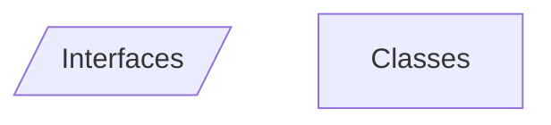
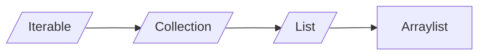
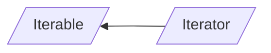
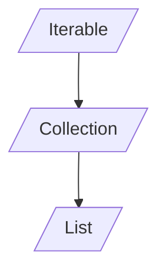

# Lezione 1
___
## Introduzione

I *paradigmi* di programmazione sono quello **operativo** e quello **funzionale**.
All'interno di tali *paradigmi* ci sono vari *stili di programmazione*.

Il *paradigma* è determinato dall'**assegnamento**.

```java
public class Main
{
	public static void main(String[] args)
	{
		int x = 3  //questa è un'inizializzazione
		x = 5 // questo è un assegnamento
	}
}
```

Per scrivere funzioni in *Java* non appartenenti a classi bisogna fare così:
 
```java
public class Main{
	public static int f(int n){
		return n + 1;
	}

	public int g(int n){
		return n+1;
	}
}
```

La funzione f è **statica** e non è un **metodo** poiché non necessita di istanze e utilizzo di altri oggetti.
Anche il **main** è un metodo **statico**, perché se così non fosse bisognerebbe istanziare qualcosa per poterlo avviare.
Nel **main** per invocare f basta fare `int x = f(7)` mentre per invocare g bisogna almeno istanziare l'oggetto cui appartiene `int y = new Main().g(7)`.
Un altro modo per invocare g è:

```java
Main o = new Main();
int y = 0.g(7);
```

La semantica è la stessa, tuttavia nel primo caso l'oggetto verrà distrutto dal **garbage collector** mentre nel secondo rimane attivo.
Un oggetto viene costruito **solo** con una `new`.

```java
Main o;
int x = o.g(y);
```

Il codice precedente **compila**, tuttavia a **runtime**  sarà lanciata un'eccezione.
La variabile `o` in questo caso non è un oggetto, è solo il "luogo in cui tenerlo", una **reference**.
*Java* è infatti un linguaggio in cui le chiamate avvengono **by reference**, solamente i *tipi primitivi* sono chiamati **by value**. Gli **oggetti** pertanto sono chiamati *reference types*.

```java
Main a = new Main();
Main b = a;
```

La variabile b è un *alias*, ovvero un altro pointer allo stesso oggetto. Le **classi** sono i *tipi*, gli **oggetti** sono i *valori* (o *istanze*).
Un linguaggio è *ad oggetti* quando offre il **subtyping** (ovvero una forma di **polimorfismo**).

## Polimorfismo

```java
public class Main{
	public class Animal
	{
	
		protected int weight;
		
		public Animal(int w)
		{
			this.weight = w;
		}
		public void eat(Animal a)
		{
			this.weight = a.weight;
		}
	}
	
	public class Dog extends Animal
	{
		private boolean pedgree;
		
		public(int w, boolean ped)
		{
			super(w);
			this.pedgree = ped;
		}
		
		public void bark()
		{
			System.out.println("bau!");
		}
		
		@Override
		public void eat(Animal a)
		{
			this.weight += a.weight * 3;
		}
	}
	
	public static void main(String[] args)
	{
		Dog fido = new Dog(30, false);
		Dog gigio = fido; //alias per fido
		Animal pluto = new Dog(40, true);
		Dog pippo = new Animal(50) // non si può fare
		pluto.bark() //non si può fare perché staticamente ha                      //tipo animal 
		pluto.eat(fido); //Dynamic dispatching, viene                                  //chiamata la eat di dog
		
		Collection<Integer> c = ArrayList<Integer>();
		int sz = c.size(); //Ancora dynamic dispatching
		
		gigio.eat(gigio); //legale per subsumption
		
		pluto = gigio; //pluto resta staticamente un Animal
	} 
}
```

L'*override* serve a modificare metodi preesistenti nelle sottoclassi e di conseguenza poterli usare, anche grazie al *dynamic dispatching*.

**Dynamic Dispatching** : dopo la chiamata del metodo viene utilizzato il tipo dinamico                                                              dell'oggetto, conosciuto a runtime.
**Subsumption** : possibilità di assegnare ad una cosa meno specifica, una più specifica.

# Lezione 2
___
## Classi e Interfacce

*Estendere*  (`extends`) ed *implementare* (`implements`) un'interfaccia sono concetti equivalenti.
Le *interfacce* non hanno costruttori.
Gli unici metodi implementabili all'interno delle interfacce sono quelli con la keyword `default`.
La *classe* che implementa l'*interfaccia* è **sottotipo** di quest'ultima e deve implementare **tutti** i metodi dell'*interfaccia*, tranne quelli di **default** .

``` java
public class Misc
{
	public inteface I
	{
		void a();
		void b();
		
		default void c()
		{
			a();
			b();
		}
	}
	
	public static abstract class J
	{
		public abstract void a();
		public abstract void b();
		
		public void c()
		{
			a();
			b();
		}
	}
	
	public static class C implemets I
	{
		@Override
		public void a(){}
		@Override
		public void b(){}
	}
	
	public static void main(String[] args)
	{
	
	}
}

```





```java
import java.util.ArrayList;
import java.util.Collection;

public class ProveJDK1
{
	public static void main(String[] args)
	{
		Iterable<Integer> l = new ArrayList<Integer>();
		l.add(21);
		l.add(2);
		l.add(456);
		l.set(2, 987) //set(int, <T>)
		
		Iterator<Integer> it = l.iterator();
		while(it.hasNext())
		{
			int n = it.next();
			System.out.println(n);
		}
		
		
		// Iterazione c-like
		for(int i = 0; i < l.size(); i++)
		{
			int n = l.get(i);
			System.out.println(n);
		}
	}
}
````
# Lezione 3
___
## Creazione di iteratori
In java ogni interfaccia deve avere un *file a parte* (o essere *nested*), pertanto ogni blocco di codice corrisponderà ad un diverso file.




```java
package tinyjdk;

public interface Iterator<T>{ // T = type parameter
	boolean hasNext();
	T next();
}
```

```java
package tinyjdk;

public interface Iterable<E>{ // E = type parameter
	Iterator<E> iterator();
}
```

```java
package tinyjdk;

public interface Collection<T> extends Iterable<T>{
	void add(T x);
	
	default void addAll(Collection<T> c){ 
	//T --> type argument
		Iterator<T> it = c.iterator();
		while(it.hasNext()){
			add(it.next());
		}
	}
	
	default void clear();
	
	boolean contains(T x);
	
	boolean isEmpty();
	
	void remove(T x);
	
	int size();
}
```

```java
package tinyjdk;

public interface List<T> extends Collection<T>{
	T get (int i);
	
	T set(int i, T x);
	
	void add(int i, T x);
	
	T remove(int i); // java non da errore senza binding
}
```

```java
package tinyjdk;

public class ArrayList<T> implements List<T>{
	private Object[] a;
	private int sz;
	
	public Arraylist(){
	//con new T[10] da errore --> limitazione del linguaggio
		this.a = new Object[10];
		this.sz = 0;
	}
	
	@Override
	public void add(T x){
		if(zs >= a.length{
			Object[] old = a;
			a = new Object[a.length() * 2]
			for(int i = 0; i < old.length; i++){
				a[i] = old[i];
			}
		}
		s[sz++] = x; // subsume x ad object
	}
	
	@Override
	public void clear(){
		sz = 0; 
	}
	
	@Override
	public T get(int i){
		return (T) a[i]; //brutto ma legale e funzionante!
	}
	
	(...)
}
```
*Nota*: 
* In `Collection<T>`, `T`$\to$ **type parameter**
* In `Iterable<T>`, `T` $\to$ **type argument**

*Nota*: senza i **generics** si rischia di subsumere troppo con `Objects`.
## Type Parameter e Type Argument
```java
void f(int n){...} // --> n = type parameter
f(7); // --> 7 = type argument
```
**Type Parameter** determina il nome dei tipi, mentre **Type Argument** lo usa.