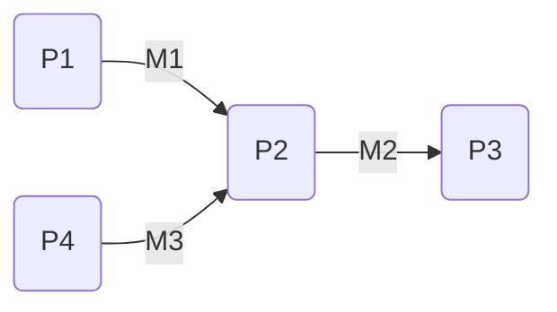
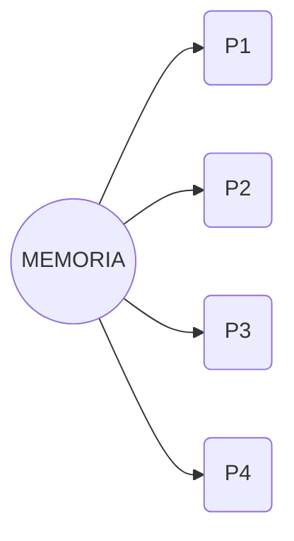
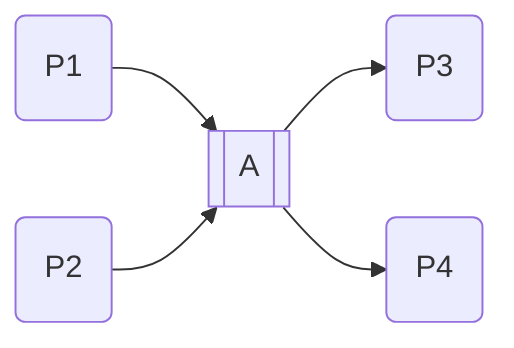

[Link del Corso](https://secgroup.dais.unive.it/teaching/laboratorio-sistemi-operativi/)
# Processi
___
## Sistema Operativo:
* **Gestore** delle risorse
* **Competizione** fra processi(*racing*)
* **Astrazione** $\rightarrow$ vediamo solo le performance
## Cooperazione fra Processi
* Diversi compiti $\to$ **Modularità**
* **Parallelismo** $\to$ più risorse fanno la stessa cosa per aumentare l'efficienza
* **Condivisione** di informazioni
* **Multitasking**
* **Replicazione** $\to$ per esempio un *server* che fa una `fork` per servire più *client*
## Modelli di Comunicazione
* **Message Passing**:



* **Memoria condivisa**:




### Nominazione Diretta

```c
send(m)
receive(&m)
send(P,m)
receive(Q,&m)
receive(&Q,&m)
```


Svincolo chi scrive e chi legge utilizzando le **porte** o **mailbox**


* **Send sincrona**: attende finchè non viene eseguita la receive
* **Send asincrona**: non attende $\to$ *messaggio "bufferizzato"*. Se il buffer è pieno si passa alla *send sincrona* o si genera un *errore*

* **Receive sincrona**: bloccante
* **Receive asincrona**: periodicamente si controlla se ci sono messaggi