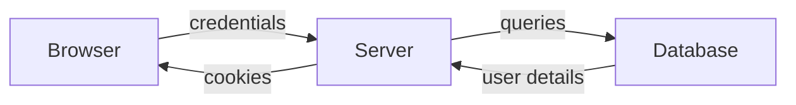
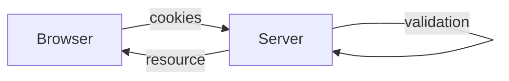

# Lesson 1
___
## Internet

* The internet is the $\color{green}global\  system$ of interconnected computer networks that uses the $\color{green}Internet\ Protocol\ Suite$ (TCP/IP) to link devices worldwide.
* Every device is identified by an $\color{green}address$ and is generally referred to as an $\color{green}host$. Two hosts may communicate even if they have no direct connection.

### Protocols

* A communication protocol is a $\color{green}set\ of\ rules$ for exchanging information over a network.
* Protocols are usually layered in a $\color{green} stack$.
* Specifies how data should be $\color{green} packetized,\ adressed,\ transmitted,\ routed$ and $\color{green}received$.
* $\color{red}Physical\ Layer$: transceiver that drives the signal on the network.
* $\color{red} Data\ Link\ Layer\ (MAC)$: creates the frames that move across the network.
* $\color{red}Network\ Layer$: creates the pakets that move across the network.
* $\color{red}Transport\ Layer\ (TCP/UDP)$: established connection between devices.
* $\color{red}Application\ Layer$: final layer.


## World Wide Web

The world Wide Web is an $\color{green} Information\ System$ in which the items of interests ($\color{green}resources$) are referred to as Uniform Resource Locators($\color{green}URL$)

Resources can be linked by $\color{green}hypertext$ and are accessible over the $\color{green}Internet$. Resources may be accessed by a $\color{green}Web\ Browser$.

### Architectural bases of the WWW

* $\color{red}URLs$ are used to identify resources
* $\color{red}Web\ agents$ communicates using $\color{green}Standardized\ protocols$ that enable interaction through the exchange of messages that adhere to a defined syntax and semantycs.
* $\color{red}Resources$ have a specific $\color{green}representation$ that can be interpreted (and visualized) by $\color{green}web\ browser$. 
		Resource $\neq$ representation. `http://www.../cat.jpg` $\rightarrow$ jpg doesn't mean anything for the web browser.
### Browsing the web

We start with a resource: `http://www.example.org/home.html`

* http is the name of the protocol used to ask for the resource
* `www.example.org` is the destination name (resolved into an IP address by the DNS (Domain Name System))
* using the HTTP protocol, the browser asks for the resource `home.html`
* The resource is downloaded by the TCP connection.
* The resource has an associated representation($\color{green} mime-type$).
# Lesson 2
___
**HTTP**: 
* A *protocol* is a set of rules. 
* It is called *hypertext* because it was once used to transmit only texts 
* It is used to *transfer* data
* It's a *request-response* protocol with a *client-server* model 
  ```mermaid
  flowchart LR
  A[[CLIENT]] --HTPP REQUEST --> B[[SERVER]]
  B -- HTTP RESPONSE --> A
  B -- HOSTS --> C(Resources)
  D(Static) --> C
  E(Generated on-demands) --> C
  ```
  Every *resource* has an associated type, called **MIME**, which is simply a *string* formatted as: `<type>/<subtype>`. 
  **Examples**:
  * the mime type of an HTML document is `text/plain`
  * the mime type of a JPEG image is `image/jpeg`
  * the mime type of JSON strings in `application/json`
Every resource has a name, called **URI** (Uniform Resource Identifier):
* **URL** (Uniform Resource Locator): identifies a resource by specifying its *location*
* **URN** (Uniform Resource Name): identifies a resource with an *unique name* $\to$ Not used!
 
  HTTP consists of  a sequence of *transactions*, composed by a *request* (client $\to$ server), followed by a *response* (server $\to$ client), formatted in an *HTTP message*
  The commands for asking a server to do something are called *HTTP  methods*, the six most common ones are:
  * GET
  * PUT
  * DELETE
  * POST
  * HEAD
  * PATCH
Every *server response* must contain a *status code*, the most popular ones are:
* 200 (Success)
* 302 (Redirect required)
* 404 (The resource does not exists)
# Lesson 3
___
* The *scheme* specifies the protocol to use to receive the resource from the server.
* *User* and *Password* can sometimes be requested to authenticated with the server. If not specified, the default user name is **anonymous**.
* The *server address* can be a **hostname** (resolved via DNS) or an **IP address**.
* The server has a *port* on which it is listening for a connection. The port can be omitted and in this case the default value will (**Example**: HTTP default port is 80).
* The *path* specifies the local location in the server (as a file in the filesystem of the server $\to$ nowadays resources are generated on the fly). The path can be divided into multiple segments separated by /.
* *Params* allows to specify a list of "key-value" pairs. They refer to the **path**
* *Query* is again a "key-value" pair used to restrict the resources of the server. They refer to the **resources**. `&` can be used to separate "key-value" pairs.
* *frag* is used to restrict the area to a specific fragment of the page.
## Absolute and Relative URLs
* `<a href-=".hammer.html"` is a **relative** URL because it doesn't contain any *schema* nor *hostname*. We need a **base URL** to which concatenate the relative URL. Base URLs can be obtained in 2 ways:
  1) By specifying it using the tag `<base>` in the document header
  2) Using the absolute URL.
* URLs can only contain symbols from the standard **ASCII**(non-ASCII characters are supported by **IRI**)
* **Character escaping** in URLs is performed in the following way:`%`+ 2 digits that identifie the character
## HTTP Connection
HTTP works at an **application** level, so we need other protocols:
* **TCP** provides a *bidirectional data stream*:
	1) **Connection-oriented**
	2) **Reliable**
	3) **Ordered** $\to$ data arrives in the same order as they where generated
	4) **Flow control** is used to avoid congestion
	5) A **TCP connection** is uniquely identified by 4 values: `<source ip> <source port> <destination ip> <destination port>`. Multiple connections with the same IP or port are allowed.
## HTTP messages
After the **TCP connection**, the HTTP protocol expects the exchange of a list of at least **2 messages**:
* a **request**
* a **response**

A  **general message** is divided in 3 parts:
* a **start line**: string describing the message followed by a newline
* a **header**: multiple text lines to define options and properties of the message. The header section end with an empty newline
* a **body**: generic data

A **request** uses those parts as following:
* **start line**: `<method> <request-URL> <version>`
* **header** : `<name1> : <value1>  <name2> : <value2>`
* **body**: *binary*, text data or an empty line

A **response** on the other hand uses them as following:
* **start line**:
* **header**:
* **body**:

# //TODO : sistemare appunti precedenti e aggiungere ultime lezioni
## Basic Authentication
* The client sends a **request** to access a certain resource.
* If the resource is protectect, the server inserts the following header in the **response**: `WWW-Authenticate: Basic realm= "<realm-name>"`, together with the status code 401.
* The client asks username and password to the user and encodes the data as a string: `<crd> = base64(<username> : <password>)`.
* The user agent for every subsequent request inserts the header `Authentication: Basic <crd>`.  base-64 encoding is then decoded and checked by the server.
### Base-64 encodind
Is an algorithm used to encode a generic byte stream to a string containing only alphanumeric characters.

*Important*: base-64 is not meant to encrypt the data, so `user:password` is just **obfuscated** and not secure at all.

**Why not just send `<username>:<password>` without encoding then?**
* Non plain ASCII characters in the password can safely inserted into the HTTP headers
* String is obfuscated to prevent humans from reading the password if the HTTP traffic is observed $\to$ seemed reasonable in the 90's.

### Problems of Basic Authentication
* Anyone can easily decode user credentials. This is the same security level as sending `username/password` without encryption.
* Even if the authentication is used for non-critical applications, user may still recycle passwords used for other websites or sensible application.
* Even if the authentication happens correctly, the provided resource may be connected to other servers
* **Server spoofing**: client cannot verify the true identity of the server

**Solution**: use basic autentication with HTTPS only.
## Digest Authentication
*Rationale*: 
	a server does not necessarily need to receive the password (shared secret) from the client. A **digest** is sufficient to prove that a client knows the correct password

**Hashing functions** are commonly used to compute those digest

*Problem*: 
	since a password always generates same digest, anyone eavesdropping on the channel can steal the digest and use it to autenticate without knowing the password $\to$ **replay attack**.
### [[Algoritmi e Strutture di Dati#Tabelle Hash| Hash Function]]
A hash function can convert any message(string) to a fixed length sequence of (random-like) bytes.

**Features**:
* Same messages generate same hashes.
* It is *one-way*.
* Collisions are possible but extremely rare.

### Nonce
To avoid the **replay attack**: 
* The server gives a **nonce** (a random, non-secret string) to the client.
* The client gives the password and the nonce to the server.
* The hash is now generated using the password and the nonce.

Using this method the digest is different in every connection.
### Andvantages of Digest Authentication
* Password is not sent in cleartext
### Problems of Digest Authentication
* Different security profiles may lead to insecure implementations
* Server's true identity cannot be verified $\to$ we can only confirm that the server is the same entity that generated the challenge (*man-in-the-middle attack is still possible*)
  ```mermaid
  flowchart LR
  C-- req -->M
  M-- req -->S
  S-- 401 digest, Nounce -->M
  M-- Nounce -->C
  ```
  ```mermaid
  flowchart LR
  C -- Digest -->M
  M -- Digest -->S
  ```
* MD5 alorithm is no more considered secure.

# JSON Web Token
## Cookies and SPA
Authentication mechanisms based on the HTTP protocol (ex. *cookies*) are traditionally used in the web apps where the content, or a large part of the business logic, is managed by the server.

Cookies where used only to store an identifier.
## Traditional Approach
* Before every other operation the server must validate the user session.
* The server entirely manages business logics.


### Negative implacts
* **Reduce scalability**: a server must keep session data in memory for every user at any given time $\to$ *reason for the timeout*. 
* **Increased coupling between server and client**: business logic must be primarily managed by the server $\to$ *client strictly bounded to the server*.

## SPA Approach
A **Single Page Application** is designed to *minimize the interaction with the server*

**Goal**: Exchange only the data strictly required for its execution.

By managing session data on the client, we gain two big advantages:
* No memory is used on the server side.
* Most of the business can me done at user side.
## Tokens
An efficient way to implement client-side sessions is by using tokens:
* The server generates a token at the time of the authentication.
* The token contains all the information needed to run the business logic for a specific client.
* The token **is signed** by the server to ensure the client cannot modify it.

## JSON Web Tokens (JWT)
Open standard to manage token-based authentication.

It is a *base-64-encoded string* composed of:
* a **header** which specifies the token type and the signature algorithm.
* A **payload** containing arbitrary data in JSON format.
* The **digital signature** of both header and payload.

## JWT: Advantages

* JWT contains not only a session identifier but any **additional data** useful to implement part of business logic on client side.
* Data is **not encrypted** but **signed**, so they cannot be modified without invalidating the signature. It is a sort of "read-only" session data structure for the client.

At every request, the entire token is sent to the server like a cookie (inside a specific HTTP header): 
```
Authorization: Bearer <token>
```

Since it contains all the information associated with a user, the server does not have to keep session data in memory.
*Trade-off*: bandwidth vs server memory usage.