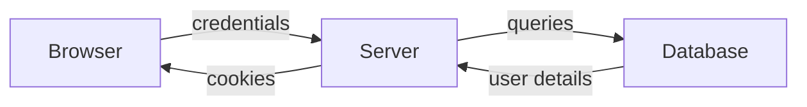
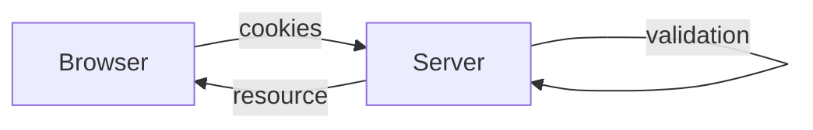

# Introduction
___
## Internet

* The internet is the **global  system** of interconnected computer networks that uses the **Internet Protocol Suite** (TCP/IP) to link devices worldwide.
* Every device is identified by an **address** and is generally referred to as an **host**. Two hosts may communicate even if they have no direct connection.

## Protocols

* A communication protocol is a **set of rules** for exchanging information over a network.
* Protocols are usually layered in a **stack**.
* Specifies how data should be **packetized**, **adressed**, **transmitted**, **routed** and **received**.
* **Physical Layer**: transceiver that drives the signal on the network.
* **Data Link Layer** (MAC): creates the frames that move across the network.
* **Network Layer** (IP): creates the pakets that move across the network.
* **Transport Layer** (TCP/UDP): established connection between devices.
* **Application Layer**: group of applications requiring network communications.

![[Pasted image 20240308155921.png]]
## World Wide Web

The world Wide Web is an **Information System** in which the items of interests (**resources**) are referred to with the Uniform Resource Locators(**URL**).

Resources can be linked by **hypertext** and are accessible over the Internet. Resources may be accessed by a **Web Browser**.
## Architectural bases of the WWW

* **URLs** are used to identify resources
* **Web agents** communicate using *standardized protocols* that enable interaction through the exchange of messages that adhere to a defined syntax and semantycs.
* **Resources** have a specific *representation* that can be interpreted (and visualized) by *web browsers*. 
  Resource $\neq$ representation. `http://www.../cat.jpg` $\rightarrow$ jpg doesn't mean anything for the web browser.
## Browsing the web

We start with a resource: `http://www.example.org/home.html`

* **http** is the name of the protocol used to ask for the resource
* `www.example.org` is the **destination name** (resolved into an *IP address* by the *DNS* (Domain Name System))
* using the HTTP protocol, the browser asks for the **resource** `home.html`
* The resource is downloaded by the TCP connection.
* The resource has an associated representation(**mime-type**).
# HTTP
___ 
## Introduction
**HTTP** (HyperText Tranfer Protocol) is the principal communication protocol for the web.

* A *protocol* is a set of rules. 
* It is called *hypertext* because it was once used to transmit only texts 
* It is used to *transfer* data
* It's a *request-response* protocol with a *client-server* model 

## Base Concepts

  ```mermaid
  flowchart LR
  A[[CLIENT]] --HTPP REQUEST --> B[[SERVER]]
  B -- HTTP RESPONSE --> A
  B -- HOSTS --> C(Resources)
  D(Static) --> C
  E(Generated on-demands) --> C
  ```

### Client-Server Model
* HTTP is a **request-response** protocol with a **client-rerver** communication model
* A typical **HTTP client** is the **web browser**. The core browser functionality is to ask resources to the server (usually HTML pages) to visualize it on screen.
* An **HTTP server** is a software that responds to the requests performed by one ore more clients.

![[Pasted image 20240308161711.png]]
### Resources and Resource Type
 The HTTP server hosts **resources**, which can be **static** or **generated on demand** by other programs.
 
![[Pasted image 20240308162037.png]]

  Every *resource* has an associated type, called **MIME** (Multipurpose Internet Mail Extension), which is simply a *string* formatted as: `<type>/<subtype>`.

![[Pasted image 20240308162134.png]]

  **Examples**:
  * the mime type of an HTML document is `text/plain`
  * the mime type of a JPEG image is `image/jpeg`
  * the mime type of JSON strings in `application/json`


### Resource Identifier
Every resource has a name, called **URI** (Uniform Resource Identifier):
* **URL** (Uniform Resource Locator): identifies a resource by specifying its *location*
* **URN** (Uniform Resource Name): identifies a resource with an *unique name* $\to$ Not used!

### Request and Response
  HTTP consists of  a sequence of **transactions**, composed by a **request** (client $\to$ server), followed by a **response** (server $\to$ client), formatted in an *HTTP message*.

![[Pasted image 20240308162359.png]]
### Methods
  The commands for asking a server to do something are called *HTTP  methods*, the six most common ones are:
  * GET
  * PUT
  * DELETE
  * POST
  * HEAD
  * PATCH
### Status Code
Every *server response* must contain a *status code*, the most popular ones are:
* 200 (Success)
* 302 (Redirect required)
* 404 (The resource does not exists)
### Protocol Versions
* **HTTP/0.9** $\to$ First prototipe relased in 1991. Supports only the GET method and is bugged.
* **HTTP/1.0** $\to$ First version to be adopted on a large scale. Add differents method and the MIME types.
* **HTTP/1.0+** $\to$ Added support for keep-alive connections, virtual hosting and proxies.
* **HTTP/1.1** $\to$ Corrects some bugs and adds may optimizations to improve the performance. It is the currently used version.
## URL
A Uniform Resource Locator (**URL**) is a standard name to define and identify resources inside the web.
* Usually it represent the *entry point* from which the users start browsing the web.
* Encodes the **resource name**, the **location** where to find it and **how** the browser can retrieve it.
* The general URL format comprises *9 distincts parts* (not all of them are mandatory).

## URL structure
```
<scheme>://<user>:<password>@<host>:<port>/<path>;<params>?<query>#<frag>
```
* The **scheme** specifies the protocol to use to receive the resource from the server.
* **User** and **Password** can sometimes be requested to authenticated with the server. If not specified, the default user name is *anonymous*.
* The **server address** can be a *hostname* (resolved via DNS) or an *IP address*.
* The server has a **port** on which it is listening for a connection. The port can be omitted and in this case the default value will (*Example*: HTTP default port is 80).
* The **path** specifies the local location in the server (as a file in the filesystem of the server $\to$ nowadays resources are generated on the fly). The path can be divided into multiple segments separated by /.
* **Params** allows to specify a list of "key-value" pairs. They refer to the *path*.
* Query is again a "key-value" pair used to *restrict* the resources of the server. They refer to the *resources*. `&` can be used to separate "key-value" pairs.
* **frag** is used to restrict the area to a specific fragment of the page.

![[Pasted image 20240308164840.png]]

## Absolute and Relative URLs
* `<a href-=".hammer.html"` is a **relative** URL because it doesn't contain any *schema* nor *hostname*. We need a **base URL** to which concatenate the relative URL. Base URLs can be obtained in 2 ways:
  1) By specifying it using the tag `<base>` in the document header
  2) Using the absolute URL.
* URLs can only contain symbols from the standard **ASCII**(non-ASCII characters are supported by **IRI**)
* **Character escaping** in URLs is performed in the following way:`%`+ 2 digits that identifie the character
## Algorithm to obtain an absolute URL from a relative URL

![[Pasted image 20240308165020.png]]

## HTTP Connection

![[Pasted image 20240308165500.png]]

HTTP works at an **application** level, so we need other protocols:
* **TCP/IP** provides a *bidirectional data stream*:
	1) **Connection-oriented**
	2) **Reliable**
	3) **Ordered** $\to$ data arrives in the same order as they where generated
	4) **Flow control** is used to avoid congestion
	5) A **TCP connection** is uniquely identified by 4 values: `<source ip> <source port> <destination ip> <destination port>`. Multiple connections with the same IP or port are allowed.
## HTTP messages
After the **TCP connection**, the HTTP protocol expects the exchange of a list of at least **2 messages**:
* a **request** from the client
* a **response** from the server

A  **general message** is divided in 3 parts:
* a **start line**: string describing the message followed by a newline
* a **header**: multiple text lines to define options and properties of the message. The header section end with an empty newline
* a **body**: generic data
## Request
A **request** uses those parts as following:
* **start line**: `<method> <request-URL>`(*Resource path*)  `<version>` (*HTTP version*)
* **header** : `<name1> : <value1>  <name2> : <value2>  ...`
* **body**: *binary*, *text data* or an *empty line*.
## Possible Methods
* **GET**: Ask the server to *provide* a *certain resource*.
* **HEAD**: Ask the server to *provide* only the *resource header*.
  Usages:
    * Know the type of a resource.
    * Check if the resource exists.
    * Check if the resource has been modified.
* **PUT**: Ask the server to *store* a *certain resource*.
* **POST**: Used to *send generic data* to the server. The data aren't meant to be stored.
* **TRACE**: gives *diagnostic data* on the connection topology.
* **OPTIONS**: Ask the server for a *list of supported functionalities*.
* **DELETE**: Used to ask the server to *delete* a *resource*.
* Many other methods.
## Response
A **response** is sent by the server to the client *only after a request message is reived*.
It uses the parts described previously as following:
* **start line**: `<version> <status> <reason-phrase>`(*text description of the status code*)
* **header**: `<name1>:<value1>  <name2>:<value2>  ...`
* **body**: *Binary*, *text data* or an *empty line*.
## Status

![[Pasted image 20240308172610.png]]
## Headers
**HTTP/1.1** defines multiple **headers** according to the message type.

* **General Purpose**:  ![[Pasted image 20240308172931.png]]
* **Headers Request**: ![[Pasted image 20240308173012.png]]
  ![[Pasted image 20240308173028.png]]
* **Headers Response**: ![[Pasted image 20240308173108.png]]
* **Entity Headers**: ![[Pasted image 20240308173140.png]]

## HTTP Security

**HTTP protocol** does not intrinsically provide functions to garantuee the *security* and *secrecy* of the exchanged data.

With the evolution of the modern web, we faced the need to use a secure protocol to manage bank transactions, authentication etc.

Anyone connected on the same network can potentially eavesdrop on the traffic generated by two entities to steal confidential data or maliciously alter the content (man-in-the-middle attack)

**HTTP security** is implemented by *inserting a new layer* below it. 
2 options: 
* **SSL** (Secure Socket Layer).
* **TLS** (Transport Layer Security).

## HTTPS
The advantage of using an additional layer is that *the original HTTP protocol remains unchanged*. The underlying connection is just established in a different way.

![[Pasted image 20240308174613.png]]

## HTTPS features
* **Server Authentication**:  A client can verify the identity of the server to ensure that he is not connected to somebody else faking its identity.
* **Client Authentication**: The server can verify the client regardless of the built-in HTTP authentication method.
*  **Transmission Integrity**: It is possible to detect if the transmitted data has been tampered with by a third party agent.
* **Data Encryption**: The transmitted data are readable only by the client and server pair. Nobody can eavesdrop on the connection to steal sensible data.
## HTTPS and cryptography
HTTPS is based on the following techniques:
* **Symmetric Key Cryptography**: ![[Pasted image 20240308175510.png]]
* **Asymmetric Key Cryptography**:  Public key to crypt, private key to decrypt. Public key pairs can be freely exchanged. ![[Pasted image 20240308175655.png]]
* **Digital Signiture**: Private key used to sign a document. Public key used to verify the signature. ![[Pasted image 20240308175746.png]]
* **Digital Certificate**: ["It is an electronic document used to prove the ownership of a public key"](https://en.wikipedia.org/wiki/Public_key_certificate). It usually contains:
     * The *subject name*.
     * The *expiration date*
     * Information on the *issuer of the certificate*.
     * The *public key* of the subject.
  Everything is signed by a trusted *signing authority* that has verified the correspondence between the subject and its publickey.  
## HTTPS
When the browser connects using HTTPS, the following operations are performed:
* The *client* requests the server's *digital certificate*.
* The *signing authority* is read from the certificate.
* If the signing authority is known and preinstalled in the browser, the *digital signature* is verified by using the public key of the signing authority.
* If the signing authority is unknown (or the certificate is self-signed), the browser will warn the user that the server identity cannot be verified. ![[Pasted image 20240308180507.png]]
* After the certificate check, the *SSL/TLS layer* negotiates the security parameters for use, and a **secure encrypted channel** is established.
* After that, HTTPS works the same way as HTTP but operates on the **secure channel**.
## HTTP vs HTTPS

![[Pasted image 20240308180659.png]]
![[Pasted image 20240308180726.png]]
![[Pasted image 20240308180804.png]]
# Session & Cookies
___
## From Stateless to Stateful

HTTP  was designed to be **anonymous**,**stateless**, and with a request/response model.
Every request, even if generated by the same client, is *independent* of the ones performed previously.
## Session
However, to create rich web-application we should be able to:
* **keep track** of each client, identify it and recognize upcoming requests coming from it.
* **Associate** application data to each specific client.

The application data associated to each client and useful to implement the application logic is called **session**.
## Cookies
**Cookies** is a simple technique introduced in the *HTTP standard* to **identify users and allow permanent sessions**.

Cookies are *key-value pairs* that a server **asks the client browser to store for future usages**. They are **sent in HTPP headers** so they are invisible to the user.

![[Pasted image 20240309083725.png]]

## Cookie Types
* **Session Cookies** (or **Transient** or **in-memory cookie**): Their lifespan is *limited to the browser lifecycle*. When the browser is closed, they are automatically eliminated.
* **Persisten Cookies**: The server *explicitly defines their lifespan*. They remain valid after the browser is closed or even after the entire PC is restarded.
* **Secure Cookies**: A secure cookie can only *be sent back to the server using HTTPS*. This is useful if the cookie contains *sensible data* that can be sniffed by eavesdropping network traffic.
* **HttpOnly Cookies**: An HTTP-only cookie *cannot be read by JavaScript*. This solves the cookie stealing via *cross-site scripting*.
* **SameSite Cookies**:Cookies that can be sent only if server *A* has also provided the resource (HTML page) containing a link to a resource provided by *A*. This avoids server *B* containing links to *A* resources triggers malicious actions on previously authenticated clients (*cross-site request forgery*).

## Cookie Header
* **HTTP response header**:
  ```
  Set-Cookie: name = value [; expires = date ] [; path = path ] [; domain = domain ] [; secure] [; HttpOnly ] [; SameSite ]
  ```
    
	*  `name = value` $\to$ *Key-value pair* to store on the client user agent.
    * `[; expires = date ]` $\to$ *Cookie expiration date*. After the expiration it is automatically deleted. If this attribute is not present, a session cookie is assumed.
    * `[; path = path ]` $\to$ The cookie is *bound to a particular resource* on the server (and to all the sub-resources in the path tree).
    * `[; domain = domain ]` $\to$ The cookie is *bound to a particular domain* or subdomain.
    * `[; secure ]` $\to$ To specify that a cookieis *secure* (= can only be sent via HTTPS).
    * `[; HttpOnly ]` $\to$ JavaScript *cannot access* the cookie data.
    * `[; SameSite ]` $\to$ The cookie is *SameSite*;

* **HTTP request header**:
  ```
  Cookie: name1 = value1 [; name2 = value2 ] ...
  ``` 

## Cookies, Security and Privacy

Security and privacy problems are often *understimated* when using cookies:
* They can be **disabled**, so implicitly cookies become a *user's responsibility*.
* There exists the convinction that simple data "left by the server" cannot be harmful but cookies can be **dangerous** for our privacy and security.

The first problems regards our **privacy**. Cookies can be used to *track user movements throughout the web*:
* A web page often contains **third-party components** outside its domain (*e.g.* an advertisement banner).
* To download the advertisement, our browser makes an **HTTP request** to a **potentially malicious** external website.
* The external web server asks the user to store an **unique ID** using the cookies.
* Since the same banner exists on multiple websites, that specific user **can be tracked** throughout all the websites exhibiting that banner.

![[Pasted image 20240309090426.png]]

This technique is often used to produce *ad-hoc advertisements* on items frequently seen by a user.

**In Europe there is a special regulation for this kind of cookies**:
* Cookies used to profile users can be istalled only after a user explicitly consents to it after being informed in a simplified manner.
 
 *Typical Attacks*:
* **Network Eavesdropping**: If *HTTPS is not used*, anybody sniffing the network traffic can steal the cookies to then embody a certain user (*e.g.* to access the private home banking area of that user) 
* **Cross-Site Request Forgery**: Exploits an already authenticated user on a certain website to “forge” HTTP requests to execute malicious operations. (*e.g.* Mallory sends a chat message to Bob with the following HTML snippet:``)

Cookies are only sometimes a reliable way to identify a user.
Thecnically a cookie identifies the *tuple*: (**Browser**, **Computer**, **Account**).
If the user changes one of the 3, *he won't be identified anymore*.
This can generate **inconsistencies** on multiply devices.

Incorrect cookie usage can lead to **inconsistencies** between **session data** contined on the the server-side and **cookie content**.
This typically happens when a user manually navigates backwards in the browser history or manually changes the URL.
# Authentication
___
## Introduction
Cookies allow a web server to store **key-value pairs** to the user agent requesting a particular resource.
With this technique, we can r*ecognize the same client* throughout subsequent requests but *not its “real identity”*.
HTTP supports various mechanisms to **authenticate** a client by providing its credentials.

Authentication means **showing some evidence of the actual physical identity of a particular client**.

It is usualy based on some **shared information** between client and server (*e.g.* username-password pair) that must be exchanged securely with a predefined protocol.
## HTTP Authentication
When a client requests a protected resource, the server may respond with the status code **401** (= login required).

Together with the status code, the `WWW-authenticate` header informs the user agent to the kind of data that must be provided to authenticate.
## User Login
The web browser, according to the kind of authentication requested:
* Asks the user for a **user/password** pair.
* Creates an **HTTP header** containing the login credentials.
* Uses the header for all the subsequent resources under a specific **"authorization realm"**.

*Note*: Simila to the **cookie mechanism** $\to$ **authentication credentials** are exchanged in **HTTP headers**.
## Challenge - Response Framework

![[Pasted image 20240309092706.png]]
## Basic Authentication
* The client sends a **request** to access a certain resource.
* If the resource is protectect, the server inserts the following header in the **response**: `WWW-Authenticate: Basic realm= "<realm-name>"`, together with the status code 401.
* The client asks username and password to the user and encodes the data as a string: `<crd> = base64(<username> : <password>)`.
* The user agent for every subsequent request inserts the header `Authentication: Basic <crd>`.  base-64 encoding is then decoded and checked by the server.

![[Pasted image 20240309092824.png]]
## Base-64 encoding

![[Pasted image 20240309092751.png]]

It is an algorithm used to encode a generic byte stream to a string containing only alphanumeric characters.

*Important*: base-64 is not meant to encrypt the data, so `user:password` is just **obfuscated** and not secure at all.

**Why not just send `<username>:<password>` without encoding then?**
* Non plain ASCII characters in the password can safely inserted into the HTTP headers
* String is obfuscated to prevent humans from reading the password if the HTTP traffic is observed $\to$ seemed reasonable in the 90's.

## Problems of Basic Authentication
* Anyone can easily decode user credentials. This is the same security level as sending `username/password` without encryption.
* Even if the authentication is used for non-critical applications, user may still recycle passwords used for other websites or sensible application.
* Even if the authentication happens correctly, the provided resource may be connected to other servers
* **Server spoofing**: client cannot verify the true identity of the server

**Solution**: use basic autentication with HTTPS only.
## Digest Authentication

![[Pasted image 20240309092955.png]]

*Rationale*: 
* A server does not necessarily need to receive the password (shared secret) from the client. A **digest** is sufficient to prove that a client knows the correct password

**Hashing functions** are commonly used to compute those digest

*Problem*: 
* Since a password always generates same digest, anyone eavesdropping on the channel can steal the digest and use it to autenticate without knowing the password $\to$ **replay attack**.
## [[Algoritmi e Strutture di Dati#Tabelle Hash| Hash Function]]
A hash function can convert any message(string) to a fixed length sequence of (random-like) bytes.

**Features**:
* Same messages generate same hashes.
* It is *one-way*.
* Collisions are possible but extremely rare.
## Nonce
To avoid the **replay attack**: 
* The server gives a **nonce** (a random, non-secret string) to the client.
* The client gives the password and the nonce to the server.
* The hash is now generated using the password and the nonce.

Using this method the digest is different in every connection.
## Digest Authentication Protocol:
The (simplified) **digest authentication protocol** works as follows:
* Similar to BA, the server sends the `WWW-Authenticate` header in its response, specifying the **authentication realm** and a randomly generated **nonce**.
* The client creates the digest of the *triple* (**user**, **nonce**, **password**).
* The client sends in the **authorization header** its **username** and the **digest**.
* The server creates its **digest** (with **user**, **nonce** and **password**) to check if it *matches* the one sento by the client.
* If the two digest match, the client is **authenticated**. If not, the request is refused and a new challenge (*i.e.* a **new nonce**) is generated.
* If the client had, in turn, *sent a nonce*, the digest for the client is generated and returned in the **authorization-info header**.

![[Pasted image 20240309094643.png]]
![[Pasted image 20240309094714.png]]
![[Pasted image 20240309094744.png]]
## Advantages of Digest Authentication
* **Password** is not sent in cleartext.
* **Replay attack** is not possible (at least if the nonceis randomly generated every time).
* A client can verify if the server is the same entity that generated the challenge (**client nonce**).
## Problems of Digest Authentication
* Different security profiles may lead to insecure implementations
* Server's true identity cannot be verified $\to$ we can only confirm that the server is the same entity that generated the challenge (*man-in-the-middle attack is still possible*)
  ```mermaid
  flowchart LR
  C-- req -->M
  M-- req -->S
  S-- 401 digest, Nounce -->M
  M-- Nounce -->C
  ```
  ```mermaid
  flowchart LR
  C -- Digest -->M
  M -- Digest -->S
  ```
* MD5 alorithm is no more considered secure.

# JSON Web Token
___
## Cookies and SPA
Authentication mechanisms based on the HTTP protocol (ex. *cookies*) are traditionally used in the web apps where the content, or a large part of the business logic, is managed by the server.

Cookies where used only to store an identifier.
## Traditional Approach
* Before every other operation the server must validate the user session.
* The server entirely manages business logics.


### Negative implacts
* **Reduce scalability**: a server must keep session data in memory for every user at any given time $\to$ *reason for the timeout*. 
* **Increased coupling between server and client**: business logic must be primarily managed by the server $\to$ *client strictly bounded to the server*.

## SPA Approach
A **Single Page Application** is designed to *minimize the interaction with the server*

**Goal**: Exchange only the data strictly required for its execution.

By managing session data on the client, we gain two big advantages:
* No memory is used on the server side.
* Most of the business can me done at user side.
## Tokens
An efficient way to implement client-side sessions is by using tokens:
* The server generates a token at the time of the authentication.
* The token contains all the information needed to run the business logic for a specific client.
* The token **is signed** by the server to ensure the client cannot modify it.

## JSON Web Tokens (JWT)
Open standard to manage token-based authentication.

It is a *base-64-encoded string* composed of:
* a **header** which specifies the token type and the signature algorithm.
* A **payload** containing arbitrary data in JSON format.
* The **digital signature** of both header and payload.

## JWT: Advantages

* JWT contains not only a session identifier but any **additional data** useful to implement part of business logic on client side.
* Data is **not encrypted** but **signed**, so they cannot be modified without invalidating the signature. It is a sort of "read-only" session data structure for the client.

At every request, the entire token is sent to the server like a cookie (inside a specific HTTP header): 
```
Authorization: Bearer <token>
```

Since it contains all the information associated with a user, the server does not have to keep session data in memory.
*Trade-off*: bandwidth vs server memory usage.
# REST APIs
___
## Interoperability
The need to create techniques and protocols to allow the interoperability of various systems emerged since the advent of first computer networks. 

**Basic principle**:
>A software system can provide a set of functionalities through standard interfaces defined in advance.
## API
**Definition**:
>An Application Programming Interface (API) defines communication methods and protocols between different software components.

An API is not limited to frameworks and libraries. 
When functions are deployed throughout the web they are called **Web APIs**.
## Web APIs in the modern web

Web APIs have been **significant** for the development of the Web as we know it today. 

*Trend*: SPA in which server interaction is limited to services related to data management only (data persistence, consistency, etc.)
## Example
Suppose that we want to create an application to manage our university library. 

**Features to implement**:  
* Search for books, authors, available copies.
* Insertion of new books/authors/etc.
* Deletion of books/authors/etc.
* User management.
* … CRUD operations.

Such features will be available through a software component *exposing some APIs to be defined*. 
Problems: 
+ How to encode the data?
+ How to invoke each function?
+ How to give a high-level representation of interfaces? (*ie.* independently to a specific software platform)

## REST: simplicity is the key
Today’s trend is to use simpler encodings (ex. JSON) and APIs following specific **architectural styles** (like REST) instead of formal **protocols and standard** (like SOAP) 

**RE**presentational **S**tate **T**ransfer is an architectural style defined to help create and organize distributes systems. 
It is **based on HTTP**
## REST
Being a **style**, and not a standard, means that there are *no formal rules* to follow to create a RESTful architecture.

We have instead some **guidelines** and some **constraints** to help defining APIs with this architectural style.
## Client-Server
A REST architecture follows the client-server model. 
* Server **exposes** a set of services and **waits** for requests related to such services. 
* Requests are **performed** (by the clients) through a certain *communication channel*.

**Goal**: *separation of concerns* between services and front-end.
## Stateless
A REST architecture should be *as stateless as possible*.
Each request done from the client should have *all the information required* for the server to understand it, *without taking advantage* of any stored data.
**Each request is independent to the others**.
## Advantages of being stateless

* **Scalability**: By not having to store data between requests (*every request is indipendent from the other*), the server can free resources faster. 
* **Reliability**: A stateless system can recover from a failure much easier than one that isn’t, since the only thing to recover is the application itself.
* **Easier implementation**: We don't have race condition nor the need to store data.
* **Visibility**: Monitoring (logging) the system becomes easy when all the information required is inside the request.
## Cacheable
Every response to a request should be explicitly or implicitly set as **cacheable**. By caching the responses we can **bypass** some interactions (*e.g.* to the database) to *improve the performance*.

![[Pasted image 20240311125833.png]]

## Uniform Interface
A REST architecture *should provide a uniform interface* to all the possible clients:
* Clients can be **implemented independently** from the server.
* Client implementation is **easier** because they have **less “options”** on how to use the interfaces. 

*Drawback*: Having a standardized interface for all interactions might decrease the performance when a more optimized form of communication exists.
## Layered System
A REST architecture is designed to work properly with the *massive amount* of traffic that exists in the web. 
Components are separated into **layers** to simplify the complexity and keep component coupling in check.

![[Pasted image 20240311130713.png]]
## Resources
The *main building blocks* of a REST architecture are the **resources** (= entities). 

A resource *represent*: 
* What the **services** are going to be about.
* The **type of information** that is going to be transferred and their **related actions**.
* An **abstraction** of anything that can be conceptualized in our application.

A resource *has*:
* An **identifier** (URL) to uniquely identify a concept at any given time.
* One or more **representations** describing the structure of the information.
* Some **metadata** to specify additional useful information (format, last modification date, etc).
* **Control data**, to specify cache-directives, additional constraints, etc.
### Identifier
The resource identifier should provide:
* A unique way of identification.
* The full path to the resource 

It is defined using the standard URL syntax specifying the full resource path inside the server system (*e.g.*: `/api/j-k-rowling/books/harry-potter-and-the-halfblood-prince`).

The identifier of each resource must be able to reference it unequivocally at any given point in time. 

**Example of a bad resource identifier**:
`/api/j-k-rowling/books/last`

REST-style APIs support a whole spectrum of operations that can be performed on a certain resource. 
REST provides the concept of **actions** that a client can perform against a certain resource. Actions can be *mapped to HTTP methods* whose semantic can be made more specific using the URL’s **query** section.

**Good examples**:
```HTTP
GET /api/j-k-rowling/books?filter=last
GET /api/books?q=[search term]
PUT /api/j-k-rowling/books/harry-potter-and-the-half-
     bloodprince?action=like
```

**Bad example**:
`GET/api/j-k-rowling/books/harry-potter-and-the-half-bloodprince/like`
### Representation
A resource can have multiple representations (ex. an image can be in JPG and PNG format, data is usually in JSON).
A REST architecture can manage (at the same time) different representations of a certain resource.
A client can request a specific representation among the different alternatives.

A client can ask for a certain representation in two ways: 
* **Content negotiation**: HTTP protocol headers are used to communicate what are the available representations and what representations are accepted by the client.
  ```http
  Accept: text/html; q=1.0, text/*; q=0.8, image/gif; q=0.6,    image/jpeg; q=0.6, image/*; 
  q=0.5, */*; q=0.1
```
* **Using resource name extension**: Less sophisticated, but easier to implement for common cases (note: not based on mime types):
  ```http
  GET /api/v1/books.json
  GET /api/v1/books.xml
```
### Metadata
A resource can include some metadata to define its structure and other characteristics. 
A common principle for REST architectures is to *insert links to other resources into resource metadata*.

The main endpoint (*i.e.* root containing all the resources) usually provides **metadata** describing all the *resources managed by the interface*.

```json
GET /api/v1/ 
{"metadata": { "links": ["books": { "uri": "/books", "content-type": "application/json"}, "authors": { "uri": "/authors", "content-type": "application/json"}]}
```
## Defining a good API
How to start? What are the guidelines to define a web service with well-defined APIs? 

1. The first step is to model entities (and data) belonging to a certain context (ER diagram, objectoriented models, etc.) .
    * This allow us to define the resources managed by our system.
2.  We decide what operations (actions) can be performed on each resource.
	   * CRUD operations.
	   * Authorizations (what actions are allowed to a certain client?).
	   * What options or attributes are required on each action? For example one can retrieve (get) a resource using some filters or limiting its dimension.
3.  We decide what are the **endpoints** (*i.e.* what is the URL of each resource, what methods are used and what are the possible status codes for each action).
4. We define the metadata associated to each resource.
## What makes a good API?
### Developer Friendly
Communication protocol must be explicit and supported by multiple platforms. HTTP is the most popular choice. Endpoints should use simple and meaningful names with respect to the corresponding resources.

**Example of badly designed endpoints**:
```http
/api/getAllBooks
/api/submitNewBook
/api/getNumberOfBooksInStock
```
* **Endpoint “explosion”**. We need to create an endpoint for each pair (resource,action) .
* When we implement a new action it is **not clear** how to name the new endpoint.
* Must use conventions **known a-priori** (ex camelcase).

![[Pasted image 20240311134515.png]]

*Note*: REST style requires less endpoints to remember and provide an explicit semantics thanks to HTTP methods.

We should use **standard languages** to encode the data. A good language should be popular enough to simplify its implementation by using publicly available libraries and frameworks (*e.g*: JSON, XML, etc.)
### Should be extensible
A good API is never fully “**finished**”, for different reasons:
* The **business model** can change over time.
* **New features** are added and the old ones are removed.
* **New interfaces** might be implemented to follow new emerging technologies (*e.g.* from XML to JSON).

We should use **mechanisms** to explicitly mark the API version:
* Subsequent releases might broke the **backward compatibility** with older clients.
* **Features and interfaces** may vary with different API versions.

A common approach is the so called [Semantic Versioning (SemVer)](https://semver.org/).
Following this principle, is a good idea to *insert the API version* in the endpoint: 
```HTTP
URL itself:/api/v1/j-k-rowling/books
```
### Documentation
It is a good practice to produce a **concise documentation** to describe API endpoints.
*Example of good documentation*:
* https://developers.facebook.com/docs/graph-api/overview

### Handling of exceptions/errors
It is common, in particular when developing new APIs, that *wrong API calls are performed by the clients*:
* Wrong **endpoint names**.
* Wrong or missing **parameters**.

A good REST-style architecture should return **meaningful error messages**, explaining what’s the problem and how to avoid it.
### Security
When designing a new API, we should always take **security** into account:
* **Authentication**: what clients are allowed to use certain APIs? And how?
* **Authorizations**: What features a client might use once its identity is verified?
### Scalability

Good APIs should:
* Manage **heavy traffic loads** without sacrificing the **performance**.
* Occupy the **minimum** amount of **resources needed**.

*Suggestion*: keep the architecture **stateless** and divide the functions into **separate independent components**.
## Case Study
>Let’s create a web service with REST-style APIs to manage our departmental library. The library should manage multiple books, characterized by different authors and relevant bibliographic info. Department members (students or professors) can borrow paper copies if available. Each book can be lend for a limited period of time
### Schema

![[Pasted image 20240314143814.png]]
### Resources

![[Pasted image 20240314143911.png]]
![[Pasted image 20240314143953.png]]
### Endpoints

![[Pasted image 20240314144043.png]]
![[Pasted image 20240314144102.png]]
![[Pasted image 20240314144122.png]]
![[Pasted image 20240314144153.png]]
![[Pasted image 20240314144209.png]]
### Pagination
Each resource accessible via GET also supports the following attributes: 
* `page=<n>`
* `perpage= <m>` 

Specifying the **current page** and the **number of elements** per page.
# Containers
___
## Introduction

>A container is a sort of “lightweight VM” that can run processes in a sandbox **completely isolated** from all other processes of the host machine in which the container is running.

*Note*: unlike VMs, containers share the same OS kernel with the host.

![[Pasted image 20240314145555.png]]
## Advantages
* **Simplified deployments**: a complex application can be packaged in a single component that can be executed without worrying to configure the execution environment.
* **Fast startup**: since the OS is not fully virtualized, the startup time is reduced.
* **Portability**: a container can be created and configured on a machine and then executed on a production server without any modification.
* **Fine-grained control**: a container can provide a single component to other containers. This allows the organization of an application in microservices.
  **Scalability**: containers can be executed and terminated quickly in accordance with the required workload.
## Docker Architecture

![[Pasted image 20240314150821.png]]
![[Pasted image 20240314150840.png]]
![[Pasted image 20240314150951.png]]
![[Pasted image 20240314151013.png]]
## Containers and Images
* An **image** is a *read-only template* that is used to create a Docker container.
  An image is based on another image, with some additional customization. 
  A file named `Dockerfile` is used to *define a new image*. It contains the instruction needed to create an image and run it as a container. 
  An image is like a **class in OOP**.
* A **container** is a *runnable instance of an image*. 
  You can create, start, stop, move, or delete a container using the docker client.
  A running container can be connected to one or more networks, attached to storage, or used to create a new image based on its current state. 
  A container is like an **object in OOP**.